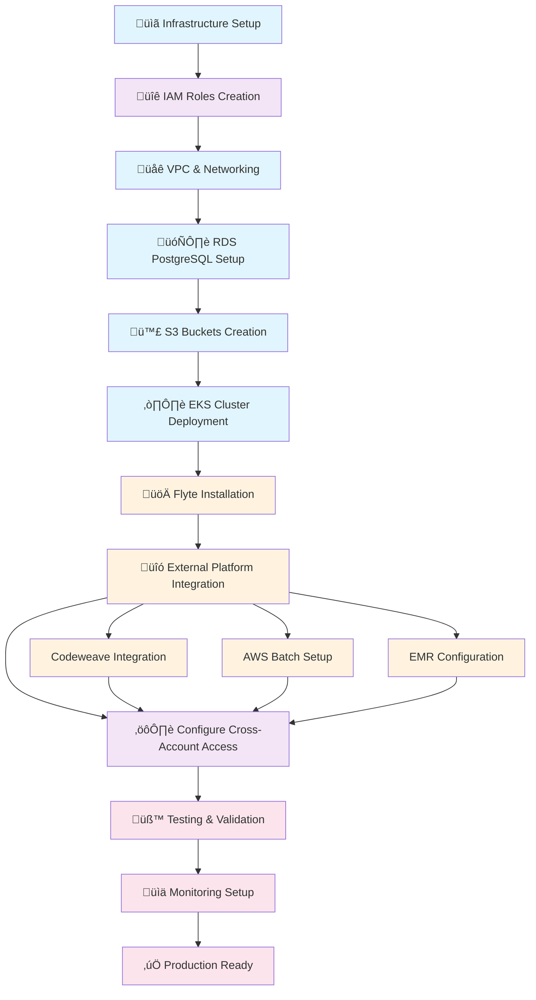

# Flyte AWS Infrastructure Design

A comprehensive guide for deploying Flyte on AWS with EKS, PostgreSQL, and multi-compute execution including external platforms like Codeweave.

## 📋 Table of Contents
1. [Architecture Overview](#architecture-overview)
2. [CDAO SDK Integration](#cdao-sdk-integration)
3. [Infrastructure Components](#infrastructure-components)
4. [Flyte Propeller & Plugin Architecture](#flyte-propeller--plugin-architecture)
5. [Network Architecture](#network-architecture)
6. [Access Roles & Security](#access-roles--security)
7. [Multi-Compute Execution](#multi-compute-execution)
8. [User Workflow with CDAO SDK](#user-workflow-with-cdao-sdk)
9. [Deployment Flow](#deployment-flow)
10. [Configuration Examples](#configuration-examples)

---

## 🏗️ Architecture Overview


## 📚 CDAO SDK Integration

### SDK Architecture & User Flow

```mermaid
graph TD
    subgraph "Data Scientist Environment"
        subgraph "Jupyter Notebook"
            CELL1[Cell 1: Import CDAO SDK<br/>import cdao_sdk]
            CELL2[Cell 2: Define ML Tasks<br/>@cdao_sdk.task]
            CELL3[Cell 3: Create Workflow<br/>@cdao_sdk.workflow]
            CELL4[Cell 4: Execute Remotely<br/>cdao_sdk.run()]
        end
        
        subgraph "CDAO SDK Components"
            AUTH[Pre-configured Auth<br/>Control Plane Access]
            CLIENT[Flyte Client<br/>API Wrapper]
            DECORATORS[Task Decorators<br/>@gpu_task, @batch_task]
            EXEC[Execution Manager<br/>Remote Submission]
        end
    end
    
    subgraph "Control Plane (AWS Account)"
        FA[Flyte Admin<br/>Workflow Registration]
        FP[Flyte Propeller<br/>Plugin Coordinator]
        
        subgraph "Flyte Plugins"
            K8S_PLUGIN[K8s Plugin<br/>Local EKS Execution]
            CW_PLUGIN[Codeweave Plugin<br/>GPU Workloads]
            BATCH_PLUGIN[AWS Batch Plugin<br/>Spot Instances]
            EMR_PLUGIN[EMR Plugin<br/>Spark Jobs]
        end
    end
    
    subgraph "Execution Environments"
        EKS_POD[EKS Pods<br/>Quick Tasks]
        CW_GPU[Codeweave GPU<br/>ML Training]
        AWS_BATCH[AWS Batch<br/>Long Jobs]
        EMR_SPARK[EMR Spark<br/>Big Data]
    end
    
    %% User Flow
    CELL1 --> AUTH
    CELL2 --> DECORATORS
    CELL3 --> CLIENT
    CELL4 --> EXEC
    
    %% SDK to Control Plane
    EXEC --> FA
    FA --> FP
    
    %% Plugin Routing
    FP --> K8S_PLUGIN
    FP --> CW_PLUGIN
    FP --> BATCH_PLUGIN
    FP --> EMR_PLUGIN
    
    %% Execution
    K8S_PLUGIN --> EKS_POD
    CW_PLUGIN --> CW_GPU
    BATCH_PLUGIN --> AWS_BATCH
    EMR_PLUGIN --> EMR_SPARK
    
    %% Styling
    classDef notebook fill:#2ecc71,stroke:#fff,color:#fff
    classDef sdk fill:#3498db,stroke:#fff,color:#fff
    classDef controlPlane fill:#663399,stroke:#fff,color:#fff
    classDef plugin fill:#9b59b6,stroke:#fff,color:#fff
    classDef execution fill:#e74c3c,stroke:#fff,color:#fff
    
    class CELL1,CELL2,CELL3,CELL4 notebook
    class AUTH,CLIENT,DECORATORS,EXEC sdk
    class FA,FP controlPlane
    class K8S_PLUGIN,CW_PLUGIN,BATCH_PLUGIN,EMR_PLUGIN plugin
    class EKS_POD,CW_GPU,AWS_BATCH,EMR_SPARK execution
```

### CDAO SDK Example Usage

```python
# Cell 1: Import and configure CDAO SDK
import cdao_sdk
from cdao_sdk import task, workflow, gpu_task, batch_task

# SDK is pre-configured with control plane access
cdao_sdk.configure(
    admin_endpoint="https://flyte.your-domain.com",
    project="ml-experiments",
    domain="development"
)

# Cell 2: Define ML tasks with platform targeting
@gpu_task(
    platform="codeweave",
    gpu_type="nvidia-tesla-v100",
    memory="32Gi"
)
def train_model(dataset_path: str, model_config: dict) -> str:
    # This runs on Codeweave GPU infrastructure
    return "s3://bucket/trained-model.pkl"

@batch_task(
    platform="aws-batch",
    instance_type="c5.4xlarge",
    spot_instances=True
)
def preprocess_data(raw_data_path: str) -> str:
    # This runs on AWS Batch with spot instances
    return "s3://bucket/processed-data.parquet"

# Cell 3: Create workflow
@workflow
def ml_pipeline(data_path: str) -> str:
    processed_data = preprocess_data(raw_data_path=data_path)
    model_path = train_model(
        dataset_path=processed_data,
        model_config={"epochs": 100, "lr": 0.001}
    )
    return model_path

# Cell 4: Execute remotely
execution = cdao_sdk.run(
    workflow=ml_pipeline,
    inputs={"data_path": "s3://bucket/raw-data.csv"}
)

# Monitor execution in real-time
cdao_sdk.monitor(execution.id)
```

## 🔧 Infrastructure Components

### Core Components Architecture


## 🔌 Flyte Propeller & Plugin Architecture

### How Propeller Orchestrates External Compute


### Plugin Configuration & Capabilities

| Plugin | Platform | Execution Model | Key Features | Use Cases |
|--------|----------|----------------|--------------|-----------|
| **K8s Plugin** | Local EKS | Pod-based | - Fast startup<br/>- Resource limits<br/>- Local networking | Development, Quick tasks, Testing |
| **Codeweave Plugin** | External K8s | Remote job submission | - GPU acceleration<br/>- ML optimized<br/>- Auto-scaling | Deep learning, Model training, GPU workloads |
| **AWS Batch Plugin** | AWS Batch | Containerized jobs | - Spot instances<br/>- Queue management<br/>- Cost optimization | Batch processing, Long-running jobs, ETL |
| **EMR Plugin** | Amazon EMR | Spark steps | - Distributed computing<br/>- Big data optimized<br/>- Transient clusters | Analytics, Big data, Distributed ML |

### Plugin Communication Flow


## 🔍 Where Does Propeller Run and How Does It Work?

### Propeller Deployment Location

```mermaid
graph TB
    subgraph "Control Plane EKS Cluster (AWS Account)"
        subgraph "flyte-system namespace"
            FP[Flyte Propeller Pod<br/>🏠 Runs in Control Plane<br/>📡 Manages All External Plugins<br/>🔄 Never Leaves EKS Cluster]
            
            subgraph "Plugin Registry (In-Memory)"
                K8S_PLUGIN[K8s Plugin<br/>Local Execution]
                CW_PLUGIN[Codeweave Plugin<br/>HTTP API Client]
                BATCH_PLUGIN[AWS Batch Plugin<br/>AWS SDK Client]
                EMR_PLUGIN[EMR Plugin<br/>AWS SDK Client]
            end
        end
        
        subgraph "Local Task Execution"
            LOCAL_PODS[Task Pods<br/>Created by K8s Plugin]
        end
    end
    
    subgraph "External APIs (Internet)"
        CW_API[Codeweave API<br/>api.codeweave.com]
        AWS_BATCH[AWS Batch API<br/>batch.us-east-1.amazonaws.com]
        EMR_API[EMR API<br/>elasticmapreduce.us-east-1.amazonaws.com]
    end
    
    subgraph "External Execution (Remote)"
        CW_CLUSTER[Codeweave GPU Cluster<br/>🌍 External Infrastructure]
        BATCH_JOBS[AWS Batch Jobs<br/>🌍 Customer AWS Account]
        EMR_CLUSTER[EMR Spark Cluster<br/>🌍 Customer AWS Account]
    end
    
    %% Propeller stays in control plane
    FP --> K8S_PLUGIN
    FP --> CW_PLUGIN
    FP --> BATCH_PLUGIN
    FP --> EMR_PLUGIN
    
    %% Local execution
    K8S_PLUGIN --> LOCAL_PODS
    
    %% External API calls (Propeller makes these)
    CW_PLUGIN --> CW_API
    BATCH_PLUGIN --> AWS_BATCH
    EMR_PLUGIN --> EMR_API
    
    %% Remote execution (Propeller never goes here)
    CW_API --> CW_CLUSTER
    AWS_BATCH --> BATCH_JOBS
    EMR_API --> EMR_CLUSTER
    
    %% Styling
    classDef controlPlane fill:#663399,stroke:#fff,color:#fff
    classDef plugin fill:#9b59b6,stroke:#fff,color:#fff
    classDef external fill:#e74c3c,stroke:#fff,color:#fff
    classDef api fill:#f39c12,stroke:#fff,color:#fff
    
    class FP,LOCAL_PODS controlPlane
    class K8S_PLUGIN,CW_PLUGIN,BATCH_PLUGIN,EMR_PLUGIN plugin
    class CW_CLUSTER,BATCH_JOBS,EMR_CLUSTER external
    class CW_API,AWS_BATCH,EMR_API api
```



### How Propeller Uses Plugins for External Execution

**Key Concept**: Flyte Propeller **never leaves the control plane**. Instead, it uses plugins as **API clients** to submit jobs to external platforms.

#### 1. **Propeller Location**
- **Runs**: Inside the control plane EKS cluster in AWS
- **Namespace**: `flyte-system` namespace
- **Pod**: Single deployment managing all workflow executions
- **Network**: Has access to internet via NAT Gateway for API calls

#### 2. **Plugin Architecture**
```yaml
# Propeller uses built-in and custom plugins
plugins:
  # Local Kubernetes execution
  k8s-array: 
    type: "k8s"
    config: "in-cluster"
  
  # Codeweave plugin (HTTP API client)
  codeweave:
    type: "external"
    endpoint: "https://api.codeweave.com"
    auth_type: "api_key"
    
  # AWS Batch plugin (AWS SDK client)  
  batch:
    type: "aws_batch"
    region: "us-east-1"
    job_queue: "flyte-batch-queue"
    
  # EMR plugin (AWS SDK client)
  spark:
    type: "emr"
    region: "us-east-1"
```

#### 3. **Execution Flow for External Platforms**

**For Codeweave Tasks:**
1. **CDAO SDK** submits `@gpu_task` to Flyte Admin
2. **Flyte Admin** stores workflow and queues execution
3. **Propeller** picks up task and evaluates `@gpu_task` decorator
4. **Codeweave Plugin** (running inside Propeller pod):
   - Makes HTTP API call to `api.codeweave.com`
   - Submits container image and resource requirements
   - Receives job ID and monitors status
5. **Codeweave Platform** executes the job on their GPU infrastructure
6. **Plugin** polls Codeweave API for completion
7. **Propeller** updates task status in Flyte Admin

**For AWS Batch Tasks:**
1. **CDAO SDK** submits `@batch_task` to Flyte Admin
2. **Propeller** routes to AWS Batch Plugin
3. **Batch Plugin** (running inside Propeller pod):
   - Uses AWS SDK to call `batch.amazonaws.com`
   - Submits job to specified queue
   - Monitors job status via AWS APIs
4. **AWS Batch** executes job on EC2 instances
5. **Plugin** receives completion notification
6. **Propeller** updates workflow status

#### 4. **Network Requirements**


#### 5. **Security & Access Control**
- **IAM Roles**: Propeller pod uses IAM roles for AWS service access
- **API Keys**: Stored as Kubernetes secrets for external platforms
- **Network Policies**: Restrict outbound access to required APIs only
- **Cross-Account**: For external AWS services, uses AssumeRole patterns

#### 6. **Plugin Development for New Platforms**
```python
# Example: Custom plugin for new platform
class CustomPlatformPlugin:
    def __init__(self, config):
        self.api_endpoint = config.endpoint
        self.api_key = config.api_key
    
    def submit_task(self, task_config):
        # Make HTTP call to external platform
        response = requests.post(
            f"{self.api_endpoint}/jobs",
            headers={"Authorization": f"Bearer {self.api_key}"},
            json=task_config
        )
        return response.json()["job_id"]
    
    def check_status(self, job_id):
        # Poll external platform for status
        response = requests.get(
            f"{self.api_endpoint}/jobs/{job_id}/status"
        )
        return response.json()["status"]
```

**This architecture ensures:**
- ✅ **Security**: Propeller never leaves secure control plane
- ✅ **Scalability**: Can integrate with unlimited external platforms
- ✅ **Reliability**: Centralized monitoring and error handling
- ✅ **Cost Optimization**: Route tasks to most cost-effective platforms
- ✅ **Simplicity**: Users just use decorators, complexity is hidden

## 🌐 Network Architecture


## 🔐 Access Roles & Security

### IAM Role Architecture


### Security Flow Diagram


## 🚀 Multi-Compute Execution

### Execution Platform Integration

```mermaid
graph LR
    subgraph "CDAO SDK (User Environment)"
        SDK[CDAO SDK<br/>Task Decorators]
        PLAT_SEL[Platform Selection<br/>@gpu_task, @batch_task<br/>@spark_task, @cpu_task]
    end
    
    subgraph "Flyte Propeller Decision Engine"
        FP[Flyte Propeller<br/>Plugin Coordinator]
        TE[Task Evaluator<br/>Platform Routing<br/>Resource Matching<br/>Cost Optimization]
    end
    
    subgraph "Local EKS Execution"
        EKS_POD[EKS Pod Execution<br/>- CPU Tasks<br/>- Quick Jobs<br/>- Development/Testing<br/>- Low Latency]
    end
    
    subgraph "Codeweave Platform (Plugin-based)"
        CW_GPU[GPU Workloads<br/>- ML Training<br/>- Deep Learning<br/>- Model Inference<br/>- @gpu_task decorator]
        CW_CPU[CPU Workloads<br/>- Data Processing<br/>- ETL Jobs<br/>- Batch Analysis<br/>- @codeweave_task]
    end
    
    subgraph "AWS Batch (Plugin-based)"
        BATCH_SPOT[Spot Instance Jobs<br/>- Cost-sensitive<br/>- Fault-tolerant<br/>- Long-running<br/>- @batch_task(spot=True)]
        BATCH_DEMAND[On-Demand Jobs<br/>- Time-critical<br/>- Guaranteed capacity<br/>- SLA requirements<br/>- @batch_task(on_demand=True)]
    end
    
    subgraph "Amazon EMR (Plugin-based)"
        EMR_SPARK[Spark Clusters<br/>- Big Data Processing<br/>- Analytics Workloads<br/>- Distributed Computing<br/>- @spark_task decorator]
    end
    
    %% User SDK Flow
    SDK --> PLAT_SEL
    PLAT_SEL --> FP
    
    %% Task Routing Logic
    FP --> TE
    TE --> EKS_POD
    TE --> CW_GPU
    TE --> CW_CPU
    TE --> BATCH_SPOT
    TE --> BATCH_DEMAND
    TE --> EMR_SPARK
    
    %% Results Storage
    EKS_POD --> S3[(S3 Results<br/>Unified Storage)]
    CW_GPU --> S3
    CW_CPU --> S3
    BATCH_SPOT --> S3
    BATCH_DEMAND --> S3
    EMR_SPARK --> S3
    
    %% Styling
    classDef sdk fill:#2ecc71,stroke:#fff,color:#fff
    classDef flyte fill:#663399,stroke:#fff,color:#fff
    classDef local fill:#3498db,stroke:#fff,color:#fff
    classDef external fill:#e74c3c,stroke:#fff,color:#fff
    classDef aws fill:#ff9900,stroke:#fff,color:#fff
    classDef storage fill:#95a5a6,stroke:#fff,color:#fff
    
    class SDK,PLAT_SEL sdk
    class FP,TE flyte
    class EKS_POD local
    class CW_GPU,CW_CPU external
    class BATCH_SPOT,BATCH_DEMAND,EMR_SPARK aws
    class S3 storage
```

### Enhanced Task Execution Decision Matrix

| Task Type | CDAO SDK Decorator | Resource Requirements | Duration | Cost Sensitivity | Platform Selection | Plugin Used |
|-----------|-------------------|----------------------|----------|------------------|------------------|-------------|
| **Model Training (Deep Learning)** | `@gpu_task` | GPU (V100/A100), High Memory | Hours to Days | Medium | **Codeweave GPU** | Codeweave Plugin |
| **Data Preprocessing** | `@batch_task(spot=True)` | CPU, Medium Memory | Minutes to Hours | High | **AWS Batch (Spot)** | Batch Plugin |
| **Model Inference** | `@cpu_task` | CPU/GPU, Low Latency | Seconds to Minutes | Low | **EKS Pods** | K8s Plugin |
| **ETL Processing** | `@batch_task` | CPU, High Memory | Hours | High | **AWS Batch** | Batch Plugin |
| **Analytics Queries** | `@spark_task` | CPU, High Memory, Distributed | Minutes to Hours | Medium | **EMR Spark** | EMR Plugin |
| **Development/Testing** | `@task` | CPU, Low Memory | Minutes | Low | **EKS Pods** | K8s Plugin |
| **GPU Inference** | `@gpu_task(inference=True)` | GPU, Low Memory | Seconds | Medium | **Codeweave GPU** | Codeweave Plugin |
| **Big Data ML** | `@spark_task(ml=True)` | CPU, Distributed, High Memory | Hours | Medium | **EMR Spark** | EMR Plugin |

## 📱 User Workflow with CDAO SDK

### Complete User Journey


### Notebook-based Development Flow

```mermaid
flowchart TD
    START[Data Scientist Opens Notebook] --> INSTALL[Install CDAO SDK]
    INSTALL --> IMPORT[Import SDK & Configure]
    
    IMPORT --> EXPLORE[Exploratory Data Analysis]
    EXPLORE --> PROTOTYPE[Prototype ML Algorithm]
    PROTOTYPE --> DEFINE[Define Tasks with Decorators]
    
    subgraph "Task Definition Phase"
        DEFINE --> GPU_TASK[@gpu_task for Training]
        DEFINE --> BATCH_TASK[@batch_task for Preprocessing]
        DEFINE --> SPARK_TASK[@spark_task for Big Data]
        DEFINE --> CPU_TASK[@cpu_task for Light Work]
    end
    
    GPU_TASK --> WORKFLOW[Create Workflow]
    BATCH_TASK --> WORKFLOW
    SPARK_TASK --> WORKFLOW
    CPU_TASK --> WORKFLOW
    
    WORKFLOW --> TEST[Test Workflow Logic]
    TEST --> SUBMIT[Submit to Flyte Control Plane]
    
    subgraph "Execution Phase"
        SUBMIT --> FLYTE_ADMIN[Flyte Admin Receives]
        FLYTE_ADMIN --> PROPELLER[Propeller Routes Tasks]
        PROPELLER --> PLUGINS[Plugins Execute on Platforms]
    end
    
    PLUGINS --> MONITOR[Monitor via SDK]
    MONITOR --> RESULTS[Review Results in Notebook]
    RESULTS --> ITERATE{Need Changes?}
    
    ITERATE -->|Yes| DEFINE
    ITERATE -->|No| PRODUCTION[Deploy to Production]
    
    PRODUCTION --> SCHEDULE[Schedule Regular Runs]
    SCHEDULE --> SHARE[Share with Team]
    
    %% Styling
    classDef notebook fill:#2ecc71,stroke:#fff,color:#fff
    classDef development fill:#3498db,stroke:#fff,color:#fff
    classDef execution fill:#663399,stroke:#fff,color:#fff
    classDef production fill:#e74c3c,stroke:#fff,color:#fff
    
    class START,INSTALL,IMPORT,EXPLORE,PROTOTYPE notebook
    class DEFINE,GPU_TASK,BATCH_TASK,SPARK_TASK,CPU_TASK,WORKFLOW,TEST development
    class SUBMIT,FLYTE_ADMIN,PROPELLER,PLUGINS,MONITOR,RESULTS execution
    class PRODUCTION,SCHEDULE,SHARE production
```

## 📈 Deployment Flow



### Step-by-Step Deployment Commands

#### 1. 📋 Infrastructure Setup
```bash
# Set AWS profile and region
export AWS_PROFILE=adfs
export AWS_REGION=us-east-1

# Create VPC and networking
aws cloudformation create-stack \
  --stack-name flyte-vpc \
  --template-body file://cloudformation/vpc.yaml \
  --parameters ParameterKey=VpcCidr,ParameterValue=10.0.0.0/16

# Wait for VPC creation
aws cloudformation wait stack-create-complete \
  --stack-name flyte-vpc
```

#### 2. 🔐 IAM Roles Creation
```bash
# Create EKS service role
aws iam create-role \
  --role-name FlyteEKSServiceRole \
  --assume-role-policy-document file://iam/eks-service-role-trust-policy.json

# Attach required policies
aws iam attach-role-policy \
  --role-name FlyteEKSServiceRole \
  --policy-arn arn:aws:iam::aws:policy/AmazonEKSClusterPolicy

# Create Flyte execution role
aws iam create-role \
  --role-name FlyteExecutionRole \
  --assume-role-policy-document file://iam/flyte-execution-role-trust-policy.json

# Create cross-account role for Codeweave
aws iam create-role \
  --role-name FlyteCodeweaveRole \
  --assume-role-policy-document file://iam/codeweave-trust-policy.json
```

#### 3. 🗄️ RDS PostgreSQL Setup
```bash
# Create DB subnet group
aws rds create-db-subnet-group \
  --db-subnet-group-name flyte-db-subnet-group \
  --db-subnet-group-description "Flyte DB subnet group" \
  --subnet-ids subnet-xxx subnet-yyy

# Create PostgreSQL instance
aws rds create-db-instance \
  --db-instance-identifier flyte-postgres \
  --db-instance-class db.r5.large \
  --engine postgres \
  --engine-version 13.7 \
  --master-username flyteadmin \
  --master-user-password SecurePassword123! \
  --allocated-storage 100 \
  --db-subnet-group-name flyte-db-subnet-group \
  --vpc-security-group-ids sg-xxx \
  --multi-az \
  --storage-encrypted
```

#### 4. 🪣 S3 Buckets Creation
```bash
# Create metadata bucket
aws s3 mb s3://education-eks-flyte-metadata-$(date +%s) \
  --region us-east-1

# Create user data bucket
aws s3 mb s3://education-eks-flyte-userdata-$(date +%s) \
  --region us-east-1

# Create workflow bucket
aws s3 mb s3://bsingh-ml-workflows \
  --region us-east-1

# Enable versioning and encryption
aws s3api put-bucket-versioning \
  --bucket education-eks-flyte-metadata-$(date +%s) \
  --versioning-configuration Status=Enabled

aws s3api put-bucket-encryption \
  --bucket education-eks-flyte-metadata-$(date +%s) \
  --server-side-encryption-configuration file://s3/encryption-config.json
```

#### 5. ☸️ EKS Cluster Deployment
```bash
# Create EKS cluster
aws eks create-cluster \
  --name education-eks-flyte \
  --version 1.27 \
  --role-arn arn:aws:iam::ACCOUNT:role/FlyteEKSServiceRole \
  --resources-vpc-config subnetIds=subnet-xxx,subnet-yyy,securityGroupIds=sg-xxx

# Wait for cluster to be ready
aws eks wait cluster-active --name education-eks-flyte

# Update kubeconfig
aws eks update-kubeconfig \
  --region us-east-1 \
  --name education-eks-flyte

# Create node group
aws eks create-nodegroup \
  --cluster-name education-eks-flyte \
  --nodegroup-name flyte-workers \
  --instance-types c5.xlarge \
  --ami-type AL2_x86_64 \
  --capacity-type ON_DEMAND \
  --scaling-config minSize=2,maxSize=10,desiredSize=3 \
  --disk-size 50 \
  --node-role arn:aws:iam::ACCOUNT:role/FlyteNodeGroupRole \
  --subnets subnet-xxx subnet-yyy
```

#### 6. 🚀 Flyte Installation
```bash
# Add Flyte Helm repository
helm repo add flyteorg https://flyteorg.github.io/flyte
helm repo update

# Create Flyte namespace
kubectl create namespace flyte

# Install Flyte with custom values
helm install flyte flyteorg/flyte-core \
  --namespace flyte \
  --values flyte-values.yaml \
  --set configuration.database.host=flyte-postgres.region.rds.amazonaws.com \
  --set configuration.database.password=SecurePassword123! \
  --set configuration.storage.metadataContainer=s3://education-eks-flyte-metadata-xxx \
  --set configuration.storage.userDataContainer=s3://education-eks-flyte-userdata-xxx
```

#### 7. 🔗 External Platform Integration

##### Codeweave Integration
```bash
# Create Kubernetes secret for Codeweave credentials
kubectl create secret generic codeweave-credentials \
  --namespace flyte \
  --from-literal=api-key=your-codeweave-api-key \
  --from-literal=endpoint=https://api.codeweave.com

# Apply Codeweave plugin configuration
kubectl apply -f - <<EOF
apiVersion: v1
kind: ConfigMap
metadata:
  name: flyte-propeller-config
  namespace flyte
data:
  plugins.yaml: |
    plugins:
      codeweave:
        endpoint: https://api.codeweave.com
        auth:
          type: "api-key"
          secret: "codeweave-credentials"
        resources:
          limits:
            cpu: "8"
            memory: "32Gi"
            nvidia.com/gpu: "1"
EOF
```

##### AWS Batch Integration
```bash
# Create Batch compute environment
aws batch create-compute-environment \
  --compute-environment-name flyte-batch-env \
  --type MANAGED \
  --state ENABLED \
  --compute-resources type=EC2,minvCpus=0,maxvCpus=1000,desiredvCpus=0,instanceTypes=optimal,subnets=subnet-xxx,securityGroupIds=sg-xxx,instanceRole=arn:aws:iam::ACCOUNT:instance-profile/ecsInstanceRole

# Create job queue
aws batch create-job-queue \
  --job-queue-name flyte-batch-queue \
  --state ENABLED \
  --priority 1 \
  --compute-environment-order order=1,computeEnvironment=flyte-batch-env
```

#### 8. ⚙️ Configure Cross-Account Access
```bash
# Create trust policy for Codeweave
cat > codeweave-trust-policy.json << EOF
{
  "Version": "2012-10-17",
  "Statement": [
    {
      "Effect": "Allow",
      "Principal": {
        "AWS": "arn:aws:iam::CODEWEAVE-ACCOUNT:root"
      },
      "Action": "sts:AssumeRole",
      "Condition": {
        "StringEquals": {
          "sts:ExternalId": "flyte-execution-id"
        }
      }
    }
  ]
}
EOF

# Update role trust policy
aws iam update-assume-role-policy \
  --role-name FlyteCodeweaveRole \
  --policy-document file://codeweave-trust-policy.json

# Create access policy for S3 and services
aws iam put-role-policy \
  --role-name FlyteCodeweaveRole \
  --policy-name FlyteS3Access \
  --policy-document file://iam/s3-access-policy.json
```

#### 9. 🧪 Testing & Validation
```bash
# Test Flyte connectivity
kubectl port-forward -n flyte svc/flyte-binary-http 8088:8088 &
flytectl --config .flyte/config.yaml get projects

# Test database connectivity
kubectl exec -it -n flyte deployment/flyte-admin -- \
  psql -h flyte-postgres.region.rds.amazonaws.com -U flyteadmin -d flyteadmin

# Test S3 access
kubectl exec -it -n flyte deployment/flyte-admin -- \
  aws s3 ls s3://education-eks-flyte-metadata-xxx/

# Test Codeweave integration
pyflyte --config .flyte/config.yaml run \
  --project test \
  --domain development \
  --image ghcr.io/flyteorg/flytekit:py3.9-1.10.3 \
  test_codeweave_task.py
```

## 📊 Configuration Examples

### Flyte Values Configuration (`flyte-values.yaml`)

```yaml
# Flyte Core Configuration
configuration:
  # Database configuration
  database:
    host: "flyte-postgres.us-east-1.rds.amazonaws.com"
    port: 5432
    username: "flyteadmin"
    passwordPath: "/etc/db/password"
    dbname: "flyteadmin"
    
  # Storage configuration
  storage:
    type: s3
    container: "s3://education-eks-flyte-metadata-xxx"
    config:
      region: "us-east-1"
      auth_type: "iam"
      
  # Propeller configuration
  propeller:
    plugins:
      # Local Kubernetes execution
      k8s:
        default-cpus: "500m"
        default-memory: "500Mi"
        
      # Codeweave plugin
      codeweave:
        endpoint: "https://api.codeweave.com"
        auth:
          type: "assume-role"
          role-arn: "arn:aws:iam::ACCOUNT:role/FlyteCodeweaveRole"
        default-resources:
          cpu: "2"
          memory: "8Gi"
          gpu: "1"
          
      # AWS Batch plugin  
      batch:
        region: "us-east-1"
        job-queue: "flyte-batch-queue"
        execution-role: "arn:aws:iam::ACCOUNT:role/FlyteExecutionRole"
        
      # Spark on EMR plugin
      spark:
        cluster-id: "j-xxxxxxxxxxxxx"
        execution-role: "arn:aws:iam::ACCOUNT:role/EMR_EC2_DefaultRole"

# Service configuration
flyteadmin:
  serviceAccount:
    annotations:
      eks.amazonaws.com/role-arn: "arn:aws:iam::ACCOUNT:role/FlyteAdminRole"
      
flytepropeller:
  serviceAccount:
    annotations:
      eks.amazonaws.com/role-arn: "arn:aws:iam::ACCOUNT:role/FlytePropellerRole"

# Ingress configuration
ingress:
  enabled: true
  annotations:
    kubernetes.io/ingress.class: "alb"
    alb.ingress.kubernetes.io/scheme: "internet-facing"
    alb.ingress.kubernetes.io/target-type: "ip"
    alb.ingress.kubernetes.io/ssl-redirect: "443"
  hosts:
    - host: flyte.your-domain.com
      paths:
        - path: /*
          pathType: ImplementationSpecific
  tls:
    - secretName: flyte-tls
      hosts:
        - flyte.your-domain.com
```

### IAM Policy Examples

#### S3 Access Policy
```json
{
    "Version": "2012-10-17",
    "Statement": [
        {
            "Effect": "Allow",
            "Action": [
                "s3:GetObject",
                "s3:PutObject",
                "s3:DeleteObject",
                "s3:ListBucket"
            ],
            "Resource": [
                "arn:aws:s3:::education-eks-flyte-metadata-*",
                "arn:aws:s3:::education-eks-flyte-metadata-*/*",
                "arn:aws:s3:::education-eks-flyte-userdata-*", 
                "arn:aws:s3:::education-eks-flyte-userdata-*/*",
                "arn:aws:s3:::bsingh-ml-workflows",
                "arn:aws:s3:::bsingh-ml-workflows/*"
            ]
        }
    ]
}
```

#### Cross-Account Execution Policy
```json
{
    "Version": "2012-10-17",
    "Statement": [
        {
            "Effect": "Allow",
            "Action": [
                "sts:AssumeRole"
            ],
            "Resource": [
                "arn:aws:iam::CODEWEAVE-ACCOUNT:role/FlyteExecutionRole",
                "arn:aws:iam::ACCOUNT:role/BatchExecutionRole"
            ]
        },
        {
            "Effect": "Allow",
            "Action": [
                "batch:SubmitJob",
                "batch:DescribeJobs",
                "batch:CancelJob"
            ],
            "Resource": "*"
        },
        {
            "Effect": "Allow",
            "Action": [
                "emr:AddJobFlowSteps",
                "emr:DescribeStep",
                "emr:DescribeCluster"
            ],
            "Resource": "*"
        }
    ]
}
```

### Workflow Task Configuration Examples

#### Local EKS Task
```python
from flytekit import task, Resources
from flytekit.configuration import Config

@task(
    requests=Resources(cpu="500m", mem="1Gi"),
    limits=Resources(cpu="1", mem="2Gi"),
    container_image="ghcr.io/flyteorg/flytekit:py3.9-1.10.3"
)
def local_processing_task(data: str) -> str:
    # CPU-intensive local processing
    return f"Processed: {data}"
```

#### Codeweave GPU Task
```python
from flytekit import task, Resources
from flytekit.extras.accelerators import GPUAccelerator

@task(
    requests=Resources(cpu="4", mem="16Gi", gpu="1"),
    limits=Resources(cpu="8", mem="32Gi", gpu="1"),
    accelerator=GPUAccelerator("nvidia-tesla-v100"),
    container_image="your-registry/ml-training:latest",
    task_config={
        "platform": "codeweave",
        "instance_type": "gpu.large"
    }
)
def gpu_training_task(model_config: dict) -> str:
    # GPU-accelerated ML training
    return "model_path.pkl"
```

#### AWS Batch Task
```python
from flytekit import task, Resources

@task(
    requests=Resources(cpu="2", mem="8Gi"),
    limits=Resources(cpu="16", mem="64Gi"),
    container_image="your-registry/data-processing:latest",
    task_config={
        "platform": "batch",
        "job_queue": "flyte-batch-queue",
        "execution_role": "arn:aws:iam::ACCOUNT:role/BatchExecutionRole"
    }
)
def batch_processing_task(large_dataset: str) -> str:
    # Large-scale batch processing
    return "processed_data_path"
```

---

## 🎯 Benefits of This Architecture

### 🔒 Security Benefits
- **Network Isolation**: All Flyte components in private subnets
- **IAM Integration**: Fine-grained access control with AWS IAM
- **Cross-Account Security**: Secure external compute platform integration
- **Data Encryption**: At-rest and in-transit encryption for all data

### 💰 Cost Optimization
- **Multi-Platform Execution**: Choose most cost-effective compute for each task
- **Spot Instance Support**: Use AWS Batch with spot instances for cost savings
- **Auto-Scaling**: EKS cluster auto-scaling based on workload demand
- **Storage Optimization**: S3 lifecycle policies for data retention

### 🚀 Performance & Scalability
- **Specialized Compute**: GPU acceleration via Codeweave for ML workloads
- **Distributed Processing**: Spark on EMR for big data analytics
- **Local Execution**: Low-latency execution for quick tasks
- **Multi-AZ Deployment**: High availability across availability zones

### 🔧 Operational Excellence
- **Managed Services**: Leverage AWS managed services (RDS, S3, EKS)
- **Monitoring**: Integrated CloudWatch and Kubernetes monitoring
- **Automation**: Infrastructure as Code with CloudFormation/Terraform
- **Disaster Recovery**: Multi-AZ RDS and S3 cross-region replication

This architecture provides a production-ready, secure, and scalable foundation for running Flyte workflows across multiple compute platforms while maintaining enterprise-grade security and compliance requirements.
