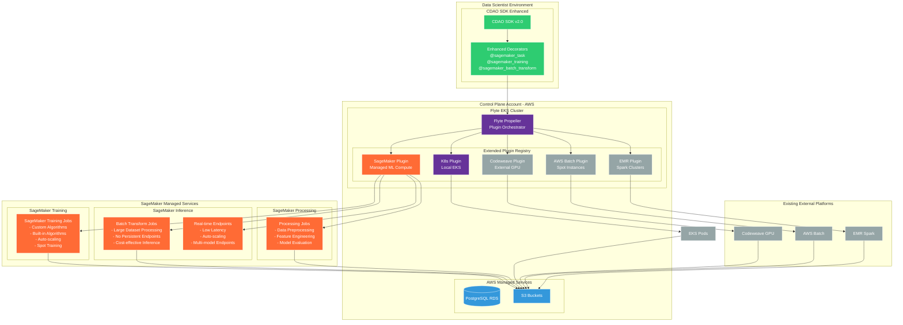
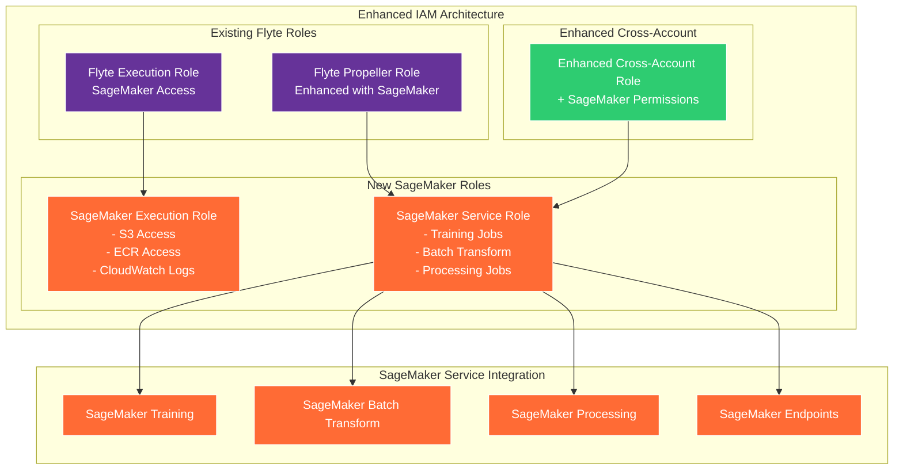
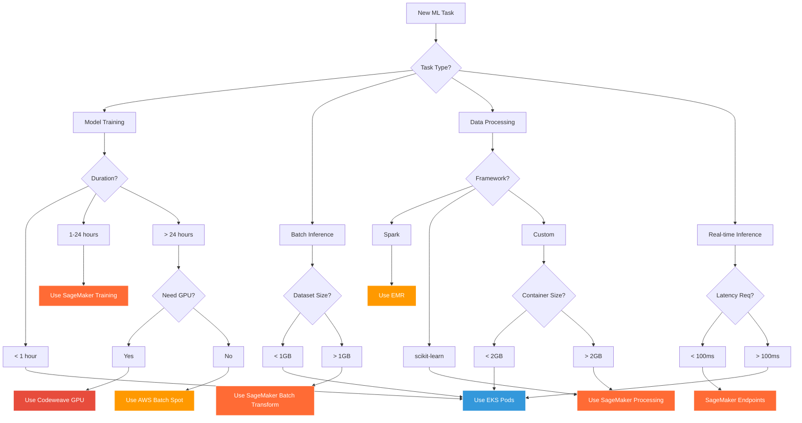

# Flyte SageMaker Integration Guide

A comprehensive guide for integrating Amazon SageMaker with your existing Flyte AWS infrastructure to run ML workflows on SageMaker's managed compute environment.

## 📋 Table of Contents
1. [Architecture Overview](#architecture-overview)
2. [SageMaker Plugin Architecture](#sagemaker-plugin-architecture)
3. [Infrastructure Updates](#infrastructure-updates)
4. [SageMaker Batch Prediction Pipeline](#sagemaker-batch-prediction-pipeline)
5. [CDAO SDK SageMaker Integration](#cdao-sdk-sagemaker-integration)
6. [Deployment Instructions](#deployment-instructions)
7. [Configuration Examples](#configuration-examples)
8. [Cost Comparison](#cost-comparison)

---

## 🏗️ Architecture Overview

### Extended Multi-Compute Architecture with SageMaker



## 🔌 SageMaker Plugin Architecture

### How Propeller Orchestrates SageMaker Jobs

```mermaid
graph TB
    subgraph "Flyte Propeller Pod (Control Plane)"
        subgraph "Core Engine"
            EXEC_ENGINE[Execution Engine<br/>Workflow State Machine]
            TASK_ROUTER[Task Router<br/>Platform Selection Logic]
            PLUGIN_MGR[Plugin Manager<br/>SageMaker Integration]
        end
        
        subgraph "SageMaker Plugin Components"
            SM_TRAINING_PLUGIN[Training Job Plugin<br/>Custom/Built-in Algorithms]
            SM_BATCH_PLUGIN[Batch Transform Plugin<br/>Large-scale Inference]
            SM_PROCESSING_PLUGIN[Processing Job Plugin<br/>Data Engineering]
            SM_ENDPOINT_PLUGIN[Endpoint Plugin<br/>Real-time Inference]
        end
        
        subgraph "State Management"
            SM_STATE[SageMaker Job State<br/>Training/Transform Status]
            SM_MONITOR[SageMaker Monitor<br/>Job Progress Tracking]
            SM_QUEUE[SageMaker Queue<br/>Pending Jobs]
        end
    end
    
    subgraph "SageMaker APIs"
        SM_API[SageMaker API<br/>sagemaker.amazonaws.com]
        SM_RUNTIME[SageMaker Runtime API<br/>Inference Endpoints]
    end
    
    subgraph "SageMaker Execution Environments"
        subgraph "Training Infrastructure"
            SM_TRAIN_CLUSTER[Training Cluster<br/>- ml.p3.2xlarge (GPU)<br/>- ml.c5.xlarge (CPU)<br/>- ml.r5.large (Memory)<br/>- Spot Training Support]
        end
        
        subgraph "Batch Transform Infrastructure"
            SM_BATCH_CLUSTER[Batch Transform Cluster<br/>- ml.m5.xlarge<br/>- ml.c5.2xlarge<br/>- Auto-scaling<br/>- Large Dataset Processing]
        end
        
        subgraph "Processing Infrastructure"
            SM_PROC_CLUSTER[Processing Cluster<br/>- ml.m5.4xlarge<br/>- Custom Containers<br/>- Spark Processing<br/>- scikit-learn Processing]
        end
    end
    
    %% Task Flow
    EXEC_ENGINE --> TASK_ROUTER
    TASK_ROUTER --> PLUGIN_MGR
    
    %% Plugin Selection
    PLUGIN_MGR --> SM_TRAINING_PLUGIN
    PLUGIN_MGR --> SM_BATCH_PLUGIN
    PLUGIN_MGR --> SM_PROCESSING_PLUGIN
    PLUGIN_MGR --> SM_ENDPOINT_PLUGIN
    
    %% API Calls
    SM_TRAINING_PLUGIN --> SM_API
    SM_BATCH_PLUGIN --> SM_API
    SM_PROCESSING_PLUGIN --> SM_API
    SM_ENDPOINT_PLUGIN --> SM_RUNTIME
    
    %% Execution
    SM_API --> SM_TRAIN_CLUSTER
    SM_API --> SM_BATCH_CLUSTER
    SM_API --> SM_PROC_CLUSTER
    
    %% State Management
    EXEC_ENGINE --> SM_STATE
    TASK_ROUTER --> SM_QUEUE
    PLUGIN_MGR --> SM_MONITOR
    
    %% Feedback Loop
    SM_TRAIN_CLUSTER -.-> SM_MONITOR
    SM_BATCH_CLUSTER -.-> SM_MONITOR
    SM_PROC_CLUSTER -.-> SM_MONITOR
    
    %% Styling
    classDef propeller fill:#663399,stroke:#fff,color:#fff
    classDef sagemaker fill:#ff6b35,stroke:#fff,color:#fff
    classDef api fill:#f39c12,stroke:#fff,color:#fff
    classDef execution fill:#e74c3c,stroke:#fff,color:#fff
    classDef state fill:#2ecc71,stroke:#fff,color:#fff
    
    class EXEC_ENGINE,TASK_ROUTER,PLUGIN_MGR propeller
    class SM_TRAINING_PLUGIN,SM_BATCH_PLUGIN,SM_PROCESSING_PLUGIN,SM_ENDPOINT_PLUGIN sagemaker
    class SM_API,SM_RUNTIME api
    class SM_TRAIN_CLUSTER,SM_BATCH_CLUSTER,SM_PROC_CLUSTER execution
    class SM_STATE,SM_MONITOR,SM_QUEUE state
```

### SageMaker Plugin Capabilities

| Plugin Component | SageMaker Service | Execution Model | Key Features | Use Cases |
|------------------|------------------|----------------|--------------|-----------|
| **Training Plugin** | SageMaker Training | Managed training jobs | - Auto-scaling compute<br/>- Spot training<br/>- Distributed training<br/>- Built-in algorithms | Model training, Hyperparameter tuning, AutoML |
| **Batch Transform Plugin** | SageMaker Batch Transform | Serverless batch inference | - No persistent endpoints<br/>- Large dataset processing<br/>- Cost-effective<br/>- Auto-scaling | Batch predictions, Large-scale inference |
| **Processing Plugin** | SageMaker Processing | Managed data processing | - Custom containers<br/>- Spark integration<br/>- scikit-learn support<br/>- Auto-scaling | Data preprocessing, Feature engineering |
| **Endpoint Plugin** | SageMaker Endpoints | Real-time inference | - Low latency<br/>- Auto-scaling<br/>- Multi-model endpoints<br/>- A/B testing | Real-time predictions, Online inference |

## 🏗️ Infrastructure Updates

### Updated IAM Roles for SageMaker Integration



## 🚀 SageMaker Batch Prediction Pipeline

### Migrated Batch Prediction Pipeline for SageMaker

```python
# Enhanced batch_prediction_pipeline.py for SageMaker
from flytekit import task, workflow, Resources
from flytekit.types.file import FlyteFile
from flytekit.types.directory import FlyteDirectory
from dataclasses import dataclass
from typing import Dict, Any
import pandas as pd

# SageMaker-specific task configurations
@dataclass
class SageMakerConfig:
    instance_type: str = "ml.m5.xlarge"
    instance_count: int = 1
    max_runtime_seconds: int = 3600
    use_spot_instances: bool = True
    spot_instance_max_wait_seconds: int = 1800

# Data preprocessing using SageMaker Processing
@task(
    task_config={
        "platform": "sagemaker",
        "job_type": "processing",
        "instance_type": "ml.m5.2xlarge",
        "instance_count": 1,
        "framework": "scikit-learn",
        "framework_version": "0.23-1"
    },
    requests=Resources(cpu="2", mem="8Gi"),
    container_image="763104351884.dkr.ecr.us-east-1.amazonaws.com/sagemaker-scikit-learn:0.23-1-cpu-py3"
)
def preprocess_data_sagemaker(
    raw_data_path: str,
    preprocessing_config: Dict[str, Any]
) -> str:
    """
    Preprocess data using SageMaker Processing Jobs
    - Runs on managed SageMaker infrastructure
    - Auto-scales based on data size
    - Cost-effective with spot instances
    """
    import boto3
    import pandas as pd
    from sklearn.preprocessing import StandardScaler, LabelEncoder
    
    # This code runs inside SageMaker Processing Job
    # Download data from S3
    s3 = boto3.client('s3')
    
    # Process data with scikit-learn
    df = pd.read_csv(raw_data_path)
    
    # Apply preprocessing steps
    scaler = StandardScaler()
    df_processed = pd.DataFrame(
        scaler.fit_transform(df.select_dtypes(include=['float64', 'int64'])),
        columns=df.select_dtypes(include=['float64', 'int64']).columns
    )
    
    # Save processed data to S3
    output_path = "s3://bsingh-ml-workflows/processed/batch_data.parquet"
    df_processed.to_parquet(output_path)
    
    return output_path

# Model training using SageMaker Training Jobs
@task(
    task_config={
        "platform": "sagemaker",
        "job_type": "training",
        "instance_type": "ml.m5.xlarge",
        "instance_count": 1,
        "algorithm": "xgboost",
        "framework_version": "1.2-1",
        "use_spot_instances": True,
        "max_runtime_seconds": 3600
    },
    requests=Resources(cpu="4", mem="16Gi"),
    container_image="763104351884.dkr.ecr.us-east-1.amazonaws.com/sagemaker-xgboost:1.2-1"
)
def train_model_sagemaker(
    processed_data_path: str,
    model_config: Dict[str, Any]
) -> str:
    """
    Train model using SageMaker Training Jobs
    - Managed infrastructure
    - Built-in XGBoost algorithm
    - Automatic model artifacts storage
    """
    import boto3
    import joblib
    import pandas as pd
    from sklearn.ensemble import RandomForestClassifier
    from sklearn.model_selection import train_test_split
    from sklearn.metrics import accuracy_score
    
    # This code runs inside SageMaker Training Job
    # Load processed data
    df = pd.read_parquet(processed_data_path)
    
    # Split data
    X = df.drop('target', axis=1) if 'target' in df.columns else df
    y = df['target'] if 'target' in df.columns else None
    
    if y is not None:
        X_train, X_test, y_train, y_test = train_test_split(X, y, test_size=0.2, random_state=42)
        
        # Train model
        model = RandomForestClassifier(**model_config.get('params', {}))
        model.fit(X_train, y_train)
        
        # Evaluate
        accuracy = accuracy_score(y_test, model.predict(X_test))
        print(f"Model accuracy: {accuracy}")
    else:
        # Unsupervised case
        model = RandomForestClassifier(**model_config.get('params', {}))
        model.fit(X, X.iloc[:, 0])  # Dummy fit for demo
    
    # Save model (SageMaker automatically uploads to S3)
    model_path = "/opt/ml/model/model.joblib"
    joblib.dump(model, model_path)
    
    return "s3://bsingh-ml-workflows/models/sagemaker_model.tar.gz"

# Batch inference using SageMaker Batch Transform
@task(
    task_config={
        "platform": "sagemaker",
        "job_type": "batch_transform",
        "instance_type": "ml.m5.large",
        "instance_count": 1,
        "max_payload_mb": 6,
        "max_concurrent_transforms": 1,
        "strategy": "SingleRecord"
    },
    requests=Resources(cpu="2", mem="4Gi")
)
def batch_predict_sagemaker(
    model_path: str,
    input_data_path: str,
    prediction_config: Dict[str, Any]
) -> str:
    """
    Perform batch predictions using SageMaker Batch Transform
    - No persistent endpoints required
    - Cost-effective for large datasets
    - Auto-scaling based on data volume
    """
    import boto3
    
    # SageMaker Batch Transform handles the inference automatically
    # Input: S3 path to input data
    # Output: S3 path to predictions
    
    output_path = "s3://bsingh-ml-workflows/predictions/batch_predictions.csv"
    
    # The actual batch transform job is managed by SageMaker
    # This task just coordinates the job submission and monitoring
    
    return output_path

# Model evaluation using SageMaker Processing
@task(
    task_config={
        "platform": "sagemaker",
        "job_type": "processing",
        "instance_type": "ml.m5.large",
        "instance_count": 1,
        "framework": "sklearn"
    },
    requests=Resources(cpu="1", mem="2Gi")
)
def evaluate_predictions_sagemaker(
    predictions_path: str,
    ground_truth_path: str,
    evaluation_config: Dict[str, Any]
) -> Dict[str, float]:
    """
    Evaluate model predictions using SageMaker Processing
    - Compute metrics and performance indicators
    - Generate evaluation reports
    """
    import boto3
    import pandas as pd
    from sklearn.metrics import accuracy_score, precision_score, recall_score, f1_score
    
    # Load predictions and ground truth
    predictions_df = pd.read_csv(predictions_path)
    ground_truth_df = pd.read_csv(ground_truth_path)
    
    # Compute metrics
    metrics = {
        "accuracy": accuracy_score(ground_truth_df['target'], predictions_df['predictions']),
        "precision": precision_score(ground_truth_df['target'], predictions_df['predictions'], average='weighted'),
        "recall": recall_score(ground_truth_df['target'], predictions_df['predictions'], average='weighted'),
        "f1_score": f1_score(ground_truth_df['target'], predictions_df['predictions'], average='weighted')
    }
    
    # Save evaluation report
    evaluation_report_path = "s3://bsingh-ml-workflows/reports/evaluation_report.json"
    
    return metrics

# Complete SageMaker ML Pipeline
@workflow
def sagemaker_batch_prediction_pipeline(
    raw_data_path: str = "s3://bsingh-ml-workflows/raw/credit_scoring.csv",
    model_config: Dict[str, Any] = {"params": {"n_estimators": 100, "max_depth": 10}},
    preprocessing_config: Dict[str, Any] = {"normalize": True},
    prediction_config: Dict[str, Any] = {"batch_size": 1000},
    evaluation_config: Dict[str, Any] = {"compute_shap": True}
) -> Dict[str, float]:
    """
    Complete ML pipeline running entirely on SageMaker managed infrastructure
    
    Pipeline Steps:
    1. Data Preprocessing (SageMaker Processing)
    2. Model Training (SageMaker Training Jobs) 
    3. Batch Prediction (SageMaker Batch Transform)
    4. Model Evaluation (SageMaker Processing)
    
    Benefits:
    - Fully managed infrastructure
    - Auto-scaling based on workload
    - Cost optimization with spot instances
    - No infrastructure management required
    """
    
    # Step 1: Preprocess data using SageMaker Processing
    processed_data = preprocess_data_sagemaker(
        raw_data_path=raw_data_path,
        preprocessing_config=preprocessing_config
    )
    
    # Step 2: Train model using SageMaker Training Jobs
    trained_model = train_model_sagemaker(
        processed_data_path=processed_data,
        model_config=model_config
    )
    
    # Step 3: Batch predictions using SageMaker Batch Transform
    predictions = batch_predict_sagemaker(
        model_path=trained_model,
        input_data_path=processed_data,
        prediction_config=prediction_config
    )
    
    # Step 4: Evaluate predictions using SageMaker Processing
    evaluation_metrics = evaluate_predictions_sagemaker(
        predictions_path=predictions,
        ground_truth_path=raw_data_path,  # Assuming ground truth is in raw data
        evaluation_config=evaluation_config
    )
    
    return evaluation_metrics

# Alternative: GPU-accelerated training for deep learning
@task(
    task_config={
        "platform": "sagemaker",
        "job_type": "training",
        "instance_type": "ml.p3.2xlarge",  # GPU instance
        "instance_count": 1,
        "framework": "pytorch",
        "framework_version": "1.8.0",
        "python_version": "py36",
        "use_spot_instances": True
    },
    requests=Resources(cpu="8", mem="32Gi", gpu="1")
)
def train_deep_learning_model_sagemaker(
    processed_data_path: str,
    model_config: Dict[str, Any]
) -> str:
    """
    Train deep learning model using SageMaker with GPU acceleration
    - PyTorch framework support
    - GPU-optimized instances (ml.p3.2xlarge)
    - Spot training for cost optimization
    """
    import torch
    import torch.nn as nn
    import pandas as pd
    
    # This runs on SageMaker GPU instances
    device = torch.device("cuda" if torch.cuda.is_available() else "cpu")
    
    # Load and prepare data
    df = pd.read_parquet(processed_data_path)
    
    # Define simple neural network
    class SimpleNN(nn.Module):
        def __init__(self, input_size, hidden_size, output_size):
            super(SimpleNN, self).__init__()
            self.fc1 = nn.Linear(input_size, hidden_size)
            self.fc2 = nn.Linear(hidden_size, output_size)
            self.relu = nn.ReLU()
            
        def forward(self, x):
            x = self.relu(self.fc1(x))
            x = self.fc2(x)
            return x
    
    # Train model
    model = SimpleNN(df.shape[1], 64, 1).to(device)
    
    # Training code here...
    
    # Save model
    torch.save(model.state_dict(), "/opt/ml/model/pytorch_model.pth")
    
    return "s3://bsingh-ml-workflows/models/pytorch_model.tar.gz"
```

## 📱 CDAO SDK SageMaker Integration

### Enhanced CDAO SDK with SageMaker Support

```python
# Enhanced CDAO SDK with SageMaker decorators
from cdao_sdk import configure
from cdao_sdk.decorators import (
    sagemaker_task, 
    sagemaker_training_task, 
    sagemaker_batch_transform_task,
    sagemaker_processing_task
)

# Configure SDK with SageMaker support
configure(
    admin_endpoint="https://flyte.your-domain.com",
    project="ml-experiments",
    domain="development",
    sagemaker_role="arn:aws:iam::ACCOUNT:role/SageMakerExecutionRole"
)

# SageMaker Training Task
@sagemaker_training_task(
    instance_type="ml.m5.xlarge",
    instance_count=1,
    framework="xgboost",
    framework_version="1.2-1",
    use_spot_instances=True,
    max_runtime_seconds=3600
)
def train_xgboost_model(dataset_path: str, hyperparameters: dict) -> str:
    """Train XGBoost model using SageMaker built-in algorithm"""
    return "s3://bucket/trained-xgboost-model.tar.gz"

# SageMaker Batch Transform Task  
@sagemaker_batch_transform_task(
    instance_type="ml.m5.large",
    instance_count=1,
    max_payload_mb=6,
    strategy="SingleRecord"
)
def batch_inference(model_path: str, input_data_path: str) -> str:
    """Perform batch inference using SageMaker Batch Transform"""
    return "s3://bucket/batch-predictions.csv"

# SageMaker Processing Task
@sagemaker_processing_task(
    instance_type="ml.m5.2xlarge",
    instance_count=1,
    framework="sklearn",
    framework_version="0.23-1"
)
def preprocess_features(raw_data_path: str) -> str:
    """Preprocess features using SageMaker Processing Jobs"""
    return "s3://bucket/processed-features.parquet"

# Complete workflow using multiple SageMaker services
@workflow
def end_to_end_sagemaker_pipeline(data_path: str) -> str:
    # Data preprocessing with SageMaker Processing
    processed_data = preprocess_features(raw_data_path=data_path)
    
    # Model training with SageMaker Training
    model_path = train_xgboost_model(
        dataset_path=processed_data,
        hyperparameters={"max_depth": 6, "eta": 0.3}
    )
    
    # Batch inference with SageMaker Batch Transform
    predictions = batch_inference(
        model_path=model_path,
        input_data_path=processed_data
    )
    
    return predictions
```

### CDAO SDK Usage Examples in Jupyter

```python
# Cell 1: Import and configure
import cdao_sdk
from cdao_sdk import sagemaker_workflow

cdao_sdk.configure_sagemaker(
    sagemaker_role="arn:aws:iam::ACCOUNT:role/SageMakerExecutionRole",
    default_bucket="bsingh-ml-workflows"
)

# Cell 2: Define SageMaker tasks
@cdao_sdk.sagemaker_training_task(
    instance_type="ml.p3.2xlarge",  # GPU for deep learning
    framework="pytorch",
    use_spot_instances=True
)
def train_pytorch_model(data_path: str) -> str:
    # PyTorch training code
    return "model_artifacts_path"

# Cell 3: Execute pipeline
execution = cdao_sdk.run(
    workflow=end_to_end_sagemaker_pipeline,
    inputs={"data_path": "s3://bsingh-ml-workflows/raw/dataset.csv"}
)

# Cell 4: Monitor SageMaker jobs
cdao_sdk.monitor_sagemaker_jobs(execution.id)
```

## 🚀 Deployment Instructions

### Step 1: Update Flyte Configuration for SageMaker

```bash
# Update Flyte Propeller configuration to include SageMaker plugin
kubectl apply -f - <<EOF
apiVersion: v1
kind: ConfigMap
metadata:
  name: flyte-propeller-config
  namespace: flyte
data:
  plugins.yaml: |
    plugins:
      # Existing plugins
      k8s:
        default-cpus: "500m"
        default-memory: "500Mi"
      
      codeweave:
        endpoint: "https://api.codeweave.com"
        auth:
          type: "api-key"
          secret: "codeweave-credentials"
          
      batch:
        region: "us-east-1"
        job-queue: "flyte-batch-queue"
        
      # New SageMaker plugin
      sagemaker:
        region: "us-east-1"
        execution-role: "arn:aws:iam::ACCOUNT:role/SageMakerExecutionRole"
        default-instance-type: "ml.m5.large"
        enable-spot-instances: true
        max-runtime-seconds: 86400
        
        # Training job configuration
        training:
          output-path: "s3://bsingh-ml-workflows/sagemaker/training/"
          instance-types:
            - "ml.m5.large"
            - "ml.m5.xlarge" 
            - "ml.m5.2xlarge"
            - "ml.p3.2xlarge"  # GPU instances
            
        # Batch transform configuration  
        batch-transform:
          output-path: "s3://bsingh-ml-workflows/sagemaker/batch-transform/"
          max-payload-mb: 6
          max-concurrent-transforms: 4
          
        # Processing job configuration
        processing:
          output-path: "s3://bsingh-ml-workflows/sagemaker/processing/"
          frameworks:
            sklearn: "0.23-1"
            pytorch: "1.8.0" 
            tensorflow: "2.4.1"
EOF
```

### Step 2: Create SageMaker IAM Roles

```bash
# Create SageMaker execution role
aws iam create-role \
  --role-name SageMakerExecutionRole \
  --assume-role-policy-document file://iam/sagemaker-execution-role-trust-policy.json

# Attach SageMaker execution policy
aws iam attach-role-policy \
  --role-name SageMakerExecutionRole \
  --policy-arn arn:aws:iam::aws:policy/AmazonSageMakerFullAccess

# Create custom policy for S3 and other services
aws iam put-role-policy \
  --role-name SageMakerExecutionRole \
  --policy-name SageMakerCustomPolicy \
  --policy-document file://iam/sagemaker-custom-policy.json

# Update Flyte Propeller role to access SageMaker
aws iam put-role-policy \
  --role-name FlytePropellerRole \
  --policy-name SageMakerAccess \
  --policy-document file://iam/flyte-sagemaker-access-policy.json
```

### Step 3: Deploy Enhanced Pipeline

```bash
# Create SageMaker workflow directory
mkdir -p /Users/bsingh/Documents/Dev/app_flyte_wf1/src/workflows/sagemaker

# Copy the enhanced batch prediction pipeline
cp batch_prediction_pipeline.py src/workflows/sagemaker/sagemaker_batch_prediction.py

# Register the new workflow with Flyte
pyflyte --config .flyte/config.yaml register \
  --project ml-experiments \
  --domain development \
  --image ghcr.io/flyteorg/flytekit:py3.9-1.10.3 \
  src/workflows/sagemaker/
```

### Step 4: Test SageMaker Integration

```bash
# Test SageMaker training job
pyflyte --config .flyte/config.yaml run \
  --project ml-experiments \
  --domain development \
  --image ghcr.io/flyteorg/flytekit:py3.9-1.10.3 \
  src/workflows/sagemaker/sagemaker_batch_prediction.py \
  sagemaker_batch_prediction_pipeline \
  --raw_data_path "s3://bsingh-ml-workflows/raw/credit_scoring.csv"

# Monitor SageMaker jobs in AWS Console
aws sagemaker list-training-jobs --status-equals InProgress
aws sagemaker list-batch-transform-jobs --status-equals InProgress
aws sagemaker list-processing-jobs --status-equals InProgress
```

## 📊 Configuration Examples

### SageMaker IAM Policies

#### SageMaker Execution Role Trust Policy
```json
{
    "Version": "2012-10-17",
    "Statement": [
        {
            "Effect": "Allow",
            "Principal": {
                "Service": "sagemaker.amazonaws.com"
            },
            "Action": "sts:AssumeRole"
        }
    ]
}
```

#### Enhanced S3 Access Policy for SageMaker
```json
{
    "Version": "2012-10-17",
    "Statement": [
        {
            "Effect": "Allow",
            "Action": [
                "s3:GetObject",
                "s3:PutObject",
                "s3:DeleteObject",
                "s3:ListBucket"
            ],
            "Resource": [
                "arn:aws:s3:::bsingh-ml-workflows",
                "arn:aws:s3:::bsingh-ml-workflows/*",
                "arn:aws:s3:::education-eks-flyte-*",
                "arn:aws:s3:::education-eks-flyte-*/*"
            ]
        },
        {
            "Effect": "Allow",
            "Action": [
                "ecr:GetAuthorizationToken",
                "ecr:BatchCheckLayerAvailability",
                "ecr:GetDownloadUrlForLayer",
                "ecr:BatchGetImage"
            ],
            "Resource": "*"
        },
        {
            "Effect": "Allow", 
            "Action": [
                "logs:CreateLogGroup",
                "logs:CreateLogStream",
                "logs:DescribeLogStreams",
                "logs:PutLogEvents"
            ],
            "Resource": "arn:aws:logs:*:*:log-group:/aws/sagemaker/*"
        }
    ]
}
```

#### Flyte Propeller SageMaker Access Policy
```json
{
    "Version": "2012-10-17",
    "Statement": [
        {
            "Effect": "Allow",
            "Action": [
                "sagemaker:CreateTrainingJob",
                "sagemaker:CreateProcessingJob", 
                "sagemaker:CreateTransformJob",
                "sagemaker:CreateModel",
                "sagemaker:CreateEndpoint",
                "sagemaker:CreateEndpointConfig",
                "sagemaker:DescribeTrainingJob",
                "sagemaker:DescribeProcessingJob",
                "sagemaker:DescribeTransformJob",
                "sagemaker:DescribeModel",
                "sagemaker:DescribeEndpoint",
                "sagemaker:DescribeEndpointConfig",
                "sagemaker:StopTrainingJob",
                "sagemaker:StopProcessingJob",
                "sagemaker:StopTransformJob",
                "sagemaker:DeleteEndpoint",
                "sagemaker:DeleteEndpointConfig",
                "sagemaker:DeleteModel"
            ],
            "Resource": "*"
        },
        {
            "Effect": "Allow",
            "Action": [
                "iam:PassRole"
            ],
            "Resource": [
                "arn:aws:iam::ACCOUNT:role/SageMakerExecutionRole"
            ]
        }
    ]
}
```

## 💰 Cost Comparison

### Platform Cost Analysis

| Platform | Instance Type | Hourly Cost | Use Case | Cost Optimization |
|----------|---------------|-------------|----------|------------------|
| **SageMaker Training** | ml.m5.xlarge | $0.23/hour | Model training | Spot instances (70% savings) |
| **SageMaker Batch Transform** | ml.m5.large | $0.115/hour | Batch inference | No persistent endpoints |
| **SageMaker Processing** | ml.m5.2xlarge | $0.46/hour | Data processing | Pay per job |
| **Codeweave GPU** | V100 | $0.50/hour | GPU workloads | External platform |
| **AWS Batch (Spot)** | c5.xlarge | $0.034/hour | CPU workloads | Spot instances |
| **EKS Pods** | c5.large | $0.085/hour | Quick tasks | Always-on cluster |

### Cost Benefits of SageMaker Integration

1. **No Infrastructure Management**: Zero overhead for managing compute infrastructure
2. **Spot Instance Support**: Up to 70% cost savings with spot training
3. **Auto-scaling**: Pay only for actual usage, no idle resources
4. **Built-in Algorithms**: Reduce development time and costs
5. **Managed Services**: No need for cluster management or maintenance

### When to Use SageMaker vs Other Platforms



---

## 🎯 Benefits of SageMaker Integration

### 🚀 **Performance Benefits**
- **Managed Infrastructure**: No cluster management overhead
- **Auto-scaling**: Automatic scaling based on workload demands
- **Optimized Instances**: Purpose-built ML instances (ml.p3, ml.c5, ml.m5)
- **Built-in Algorithms**: Pre-optimized algorithms for common ML tasks

### 💰 **Cost Benefits**
- **Spot Training**: Up to 70% cost savings with spot instances
- **No Idle Resources**: Pay only for active compute time
- **Serverless Inference**: Batch Transform eliminates persistent endpoints
- **Automatic Termination**: Jobs automatically terminate when complete

### 🔧 **Operational Benefits**
- **Zero Maintenance**: Fully managed service with no infrastructure overhead
- **Integration**: Native integration with AWS services (S3, IAM, CloudWatch)
- **Monitoring**: Built-in logging and monitoring via CloudWatch
- **Security**: Enterprise-grade security with VPC support

### 📊 **ML-Specific Benefits**
- **Framework Support**: Native support for popular ML frameworks
- **Distributed Training**: Multi-instance distributed training capabilities
- **Hyperparameter Tuning**: Built-in hyperparameter optimization
- **Model Registry**: Integrated model versioning and registry

This SageMaker integration extends your existing Flyte infrastructure to provide enterprise-grade ML capabilities while maintaining the same unified workflow orchestration experience through the CDAO SDK.
