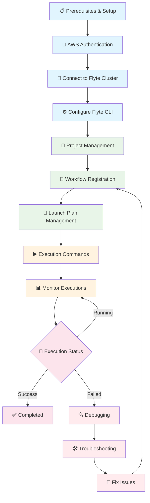

# Flyte ML Workflow Project

A comprehensive machine learning workflow project built with Flyte, featuring enterprise workspace integration and multi-tenant architecture.

## 📁 Project Structure

```
├── src/                              # Source code
│   ├── workflows/                    # Flyte workflow definitions
│   │   ├── ml_pipeline_improved.py   # Main ML pipeline
│   │   ├── batch_prediction_pipeline.py
│   │   ├── scheduled_ml_pipeline.py
│   │   └── resource_card.py
│   ├── configs/                      # Configuration files
│   │   ├── config.py                 # Python configuration
│   │   ├── project.yaml              # Flyte project config
│   │   ├── pyflyte.config           # Flyte CLI config
│   │   ├── pyproject.toml           # Python project config
│   │   └── requirements.txt         # Dependencies
│   └── data/                        # Data files
│       └── CleanCreditScoring.csv   # Sample dataset
├── containers/                      # Docker configurations
│   ├── Dockerfile                   # Basic Docker image
│   ├── Dockerfile.custom           # Custom ML image
│   └── Dockerfile.multistage       # Multi-stage build
├── scripts/                        # Build and deployment scripts
│   └── docker-build.sh            # Docker build automation
├── docs/                           # Documentation
│   ├── README.md                   # Main documentation
│   ├── architecture/               # Architecture documentation
│   │   ├── FLYTE_ARCHITECTURE_GUIDE.md
│   │   └── LAYERED_ARCHITECTURE_DIAGRAM.md
│   ├── guides/                     # Implementation guides
│   │   ├── FLYTE_MULTI_TENANT_GUIDE.md
│   │   ├── WORKSPACE_FLYTE_INTEGRATION.md
│   │   ├── AUTOMATIC_PROJECT_CREATION_FLOW.md
│   │   └── RBAC_LOCAL_VS_ENTERPRISE.md
│   └── deployment/                 # Deployment documentation
│       └── DEPLOYMENT_ARCHITECTURE.md
├── examples/                       # Example projects
│   ├── multi_file_example/         # Multi-file workflow example
│   └── oauth-learning/             # OAuth integration example
├── tests/                          # Test files
├── utils/                          # Utility functions
└── config/                         # Legacy config directory
```

## 🚀 ML Workflow Deployment Flow



### 📋 Step-by-Step Commands

#### 1. Prerequisites & Setup
```bash
# Verify required tools
flytectl version          # Flyte CLI
kubectl version --client  # Kubernetes CLI
aws --version             # AWS CLI
python --version          # Python 3.9+

# Navigate to project directory
cd /Users/bsingh/Documents/Dev/app_flyte_wf1
```

#### 2. 🔐 AWS Authentication
```bash
# Configure AWS credentials
aws configure list --profile adfs

# Update EKS kubeconfig
aws eks update-kubeconfig --region us-east-1 --name education-eks-vV8VCAqw --profile adfs
```

#### 3. 🔗 Connect to Flyte Cluster
```bash
# Set up port forwarding
kubectl port-forward -n flyte svc/flyte-binary-grpc 8089:8089 &
kubectl port-forward -n flyte svc/flyte-binary-http 8088:8088 &

# Verify services
kubectl get pods -n flyte
```

#### 4. ⚙️ Configure Flyte CLI
```bash
# Create Flyte configuration
mkdir -p .flyte
cat > .flyte/config.yaml << EOF
admin:
  endpoint: localhost:8089
  authType: Pkce
  insecure: true
logger:
  show-source: true
  level: 0
EOF

# Test connection
flytectl --config .flyte/config.yaml get projects
```

#### 5. 📁 Project Management
```bash
# Create new project
flytectl --config .flyte/config.yaml create project \
  --id ml-workflows \
  --name "ML Workflows" \
  --description "Machine Learning workflows for credit scoring"

# Verify project creation
flytectl --config .flyte/config.yaml get projects
```

#### 6. 📝 Workflow Registration
```bash
# Register ML pipeline (recommended - public image)
pyflyte --config .flyte/config.yaml register \
  --project ml-workflows \
  --domain development \
  --image ghcr.io/flyteorg/flytekit:py3.9-1.10.3 \
  ml_pipeline_improved.py

# Verify registration
flytectl --config .flyte/config.yaml get workflows \
  --project ml-workflows \
  --domain development
```

#### 7. 🚀 Launch Plan Management
```bash
# View launch plans
flytectl --config .flyte/config.yaml get launchplan \
  --project ml-workflows \
  --domain development \
  ml_pipeline_improved.credit_scoring_pipeline

# Generate execution config
flytectl --config .flyte/config.yaml get launchplan \
  --project ml-workflows \
  --domain development \
  --version <VERSION_ID> \
  ml_pipeline_improved.credit_scoring_pipeline \
  --execFile execution_config.yaml
```

#### 8. ▶️ Execution Commands
```bash
# Execute credit scoring pipeline
flytectl --config .flyte/config.yaml create execution \
  --project ml-workflows \
  --domain development \
  --execFile execution_config.yaml

# Execute with custom data
cat > generic_execution.yaml << EOF
iamRoleARN: ""
inputs:
  data_path: "s3://bsingh-ml-workflows/new-dataset/data.csv"
envs: {}
kubeServiceAcct: ""
targetDomain: ""
targetProject: ""
version: <VERSION_ID>
workflow: ml_pipeline_improved.generic_ml_pipeline
EOF
```

#### 9. 📊 Monitor Executions
```bash
# List recent executions
flytectl --config .flyte/config.yaml get executions \
  --project ml-workflows \
  --domain development \
  --limit 10

# Check specific execution
flytectl --config .flyte/config.yaml get execution \
  --project ml-workflows \
  --domain development \
  <EXECUTION_ID>

# Real-time monitoring
watch -n 5 "flytectl --config .flyte/config.yaml get execution \
  --project ml-workflows --domain development <EXECUTION_ID>"
```

#### 10. 🔍 Debugging Commands
```bash
# Get execution details with errors
flytectl --config .flyte/config.yaml get execution \
  --project ml-workflows \
  --domain development \
  <EXECUTION_ID> \
  -o yaml | grep -A 20 "error:"

# Check pod status
kubectl get pods -n ml-workflows-development
kubectl describe pod <POD_NAME> -n ml-workflows-development
kubectl logs <POD_NAME> -n ml-workflows-development

# Check execution inputs/outputs
flytectl --config .flyte/config.yaml get execution \
  --project ml-workflows \
  --domain development \
  <EXECUTION_ID> \
  -o json | jq '.spec.inputs'
```

### 🆘 Common Issues & Quick Fixes

| Issue | Quick Fix Command |
|-------|------------------|
| **Pod Scheduling Issues** | `kubectl describe pod <POD_NAME> -n ml-workflows-development` |
| **Image Pull Errors** | Re-register with: `--image ghcr.io/flyteorg/flytekit:py3.9-1.10.3` |
| **S3 Access Denied** | `aws s3 ls s3://bsingh-ml-workflows/ --profile adfs` |
| **Port Forward Timeout** | `pkill -f "port-forward"` then restart port-forward |
| **Auth Issues** | `aws eks update-kubeconfig --region us-east-1 --name education-eks-vV8VCAqw --profile adfs` |

### 🎯 Quick Command Reference
```bash
# Daily workflow (copy-paste ready)
kubectl port-forward -n flyte svc/flyte-binary-grpc 8089:8089 &
kubectl port-forward -n flyte svc/flyte-binary-http 8088:8088 &
pyflyte --config .flyte/config.yaml register --project ml-workflows --domain development --image ghcr.io/flyteorg/flytekit:py3.9-1.10.3 ml_pipeline_improved.py
flytectl --config .flyte/config.yaml create execution --project ml-workflows --domain development --execFile execution_config.yaml
```

## 📚 Documentation

### Architecture Guides
- **[Flyte Architecture Guide](docs/architecture/FLYTE_ARCHITECTURE_GUIDE.md)** - Complete Flyte two-level architecture
- **[Layered Architecture Diagram](docs/architecture/LAYERED_ARCHITECTURE_DIAGRAM.md)** - Infrastructure stack visualization

### Implementation Guides
- **[Multi-Tenant Guide](docs/guides/FLYTE_MULTI_TENANT_GUIDE.md)** - Team-based multi-tenancy setup
- **[Workspace Integration](docs/guides/WORKSPACE_FLYTE_INTEGRATION.md)** - Enterprise workspace integration
- **[Automatic Project Creation](docs/guides/AUTOMATIC_PROJECT_CREATION_FLOW.md)** - Workspace-to-project mapping
- **[RBAC Comparison](docs/guides/RBAC_LOCAL_VS_ENTERPRISE.md)** - Local vs enterprise RBAC

### Deployment Guides
- **[Deployment Architecture](docs/deployment/DEPLOYMENT_ARCHITECTURE.md)** - FastAPI service deployment

## 🔧 Configuration

### Flyte Configuration
- **Project Config**: `src/configs/project.yaml`
- **CLI Config**: `src/configs/pyflyte.config`
- **Python Config**: `src/configs/config.py`

### Docker Configuration
- **Basic Image**: `containers/Dockerfile`
- **ML Optimized**: `containers/Dockerfile.custom`
- **Multi-stage**: `containers/Dockerfile.multistage`

## 🧪 Workflows

### Available Workflows
1. **Credit Scoring Pipeline** (`ml_pipeline_improved.py`)
   - Data loading and cleaning
   - Feature engineering
   - Model training (Random Forest)
   - Model evaluation

2. **Batch Prediction Pipeline** (`batch_prediction_pipeline.py`)
   - Large-scale batch inference
   - Result aggregation

3. **Scheduled ML Pipeline** (`scheduled_ml_pipeline.py`)
   - Automated daily/weekly runs
   - Model retraining

## 🏢 Enterprise Features

### Multi-Tenant Architecture
- **Team-based isolation** with dedicated namespaces
- **Dynamic RBAC** based on workspace roles
- **Automatic project provisioning** from workspace creation
- **Workspace-native integration** with existing company infrastructure

### Security & Compliance
- **Role-based access control** (Owner/Contributor/Viewer)
- **Data boundary enforcement** with S3 bucket isolation
- **Network policy isolation** between workspaces
- **Audit logging** for all workflow executions

## 🤝 Contributing

1. Create feature branch from `main`
2. Add your workflow to `src/workflows/`
3. Update documentation in `docs/`
4. Test locally and with Docker
5. Submit pull request

## 📄 License

This project is licensed under the MIT License - see the LICENSE file for details.

## 🆘 Support

- **Documentation**: Check the `docs/` directory
- **Examples**: See `examples/` for working samples
- **Issues**: Open GitHub issues for bugs and feature requests

---

## 🔄 ML Workflow Deployment Flow


### 📋 Deployment Step-by-Step Commands

#### 1. Prerequisites & Setup
```bash
# Verify required tools
flytectl version          # Flyte CLI
kubectl version --client  # Kubernetes CLI
aws --version             # AWS CLI
python --version          # Python 3.9+

# Navigate to project directory
cd /Users/bsingh/Documents/Dev/app_flyte_wf1
```

#### 2. 🔐 AWS Authentication
```bash
# Configure AWS credentials
aws configure list --profile adfs

# Update EKS kubeconfig
aws eks update-kubeconfig --region us-east-1 --name education-eks-vV8VCAqw --profile adfs
```

#### 3. 🔗 Connect to Flyte Cluster
```bash
# Set up port forwarding
kubectl port-forward -n flyte svc/flyte-binary-grpc 8089:8089 &
kubectl port-forward -n flyte svc/flyte-binary-http 8088:8088 &

# Verify services
kubectl get pods -n flyte
```

#### 4. ⚙️ Configure Flyte CLI
```bash
# Create Flyte configuration
mkdir -p .flyte
cat > .flyte/config.yaml << EOF
admin:
  endpoint: localhost:8089
  authType: Pkce
  insecure: true
logger:
  show-source: true
  level: 0
EOF

# Test connection
flytectl --config .flyte/config.yaml get projects
```

#### 5. 📁 Project Management
```bash
# Create new project
flytectl --config .flyte/config.yaml create project \
  --id ml-workflows \
  --name "ML Workflows" \
  --description "Machine Learning workflows for credit scoring"

# Verify project creation
flytectl --config .flyte/config.yaml get projects
```

#### 6. 📝 Workflow Registration
```bash
# Register ML pipeline (recommended - public image)
pyflyte --config .flyte/config.yaml register \
  --project ml-workflows \
  --domain development \
  --image ghcr.io/flyteorg/flytekit:py3.9-1.10.3 \
  ml_pipeline_improved.py

# Verify registration
flytectl --config .flyte/config.yaml get workflows \
  --project ml-workflows \
  --domain development
```

#### 7. 🚀 Launch Plan Management
```bash
# View launch plans
flytectl --config .flyte/config.yaml get launchplan \
  --project ml-workflows \
  --domain development \
  ml_pipeline_improved.credit_scoring_pipeline

# Generate execution config
flytectl --config .flyte/config.yaml get launchplan \
  --project ml-workflows \
  --domain development \
  --version <VERSION_ID> \
  ml_pipeline_improved.credit_scoring_pipeline \
  --execFile execution_config.yaml
```

#### 8. ▶️ Execution Commands
```bash
# Execute credit scoring pipeline
flytectl --config .flyte/config.yaml create execution \
  --project ml-workflows \
  --domain development \
  --execFile execution_config.yaml

# Execute with custom data
cat > generic_execution.yaml << EOF
iamRoleARN: ""
inputs:
  data_path: "s3://bsingh-ml-workflows/new-dataset/data.csv"
envs: {}
kubeServiceAcct: ""
targetDomain: ""
targetProject: ""
version: <VERSION_ID>
workflow: ml_pipeline_improved.generic_ml_pipeline
EOF
```

#### 9. 📊 Monitor Executions
```bash
# List recent executions
flytectl --config .flyte/config.yaml get executions \
  --project ml-workflows \
  --domain development \
  --limit 10

# Check specific execution
flytectl --config .flyte/config.yaml get execution \
  --project ml-workflows \
  --domain development \
  <EXECUTION_ID>

# Real-time monitoring
watch -n 5 "flytectl --config .flyte/config.yaml get execution \
  --project ml-workflows --domain development <EXECUTION_ID>"
```

#### 10. 🔍 Debugging Commands
```bash
# Get execution details with errors
flytectl --config .flyte/config.yaml get execution \
  --project ml-workflows \
  --domain development \
  <EXECUTION_ID> \
  -o yaml | grep -A 20 "error:"

# Check pod status
kubectl get pods -n ml-workflows-development
kubectl describe pod <POD_NAME> -n ml-workflows-development
kubectl logs <POD_NAME> -n ml-workflows-development

# Check execution inputs/outputs
flytectl --config .flyte/config.yaml get execution \
  --project ml-workflows \
  --domain development \
  <EXECUTION_ID> \
  -o json | jq '.spec.inputs'
```

### 🆘 Common Issues & Quick Fixes

| Issue | Quick Fix Command |
|-------|------------------|
| **Pod Scheduling Issues** | `kubectl describe pod <POD_NAME> -n ml-workflows-development` |
| **Image Pull Errors** | Re-register with: `--image ghcr.io/flyteorg/flytekit:py3.9-1.10.3` |
| **S3 Access Denied** | `aws s3 ls s3://bsingh-ml-workflows/ --profile adfs` |
| **Port Forward Timeout** | `pkill -f "port-forward"` then restart port-forward |
| **Auth Issues** | `aws eks update-kubeconfig --region us-east-1 --name education-eks-vV8VCAqw --profile adfs` |

### 🎯 Quick Command Reference
```bash
# Daily workflow (copy-paste ready)
kubectl port-forward -n flyte svc/flyte-binary-grpc 8089:8089 &
kubectl port-forward -n flyte svc/flyte-binary-http 8088:8088 &
pyflyte --config .flyte/config.yaml register --project ml-workflows --domain development --image ghcr.io/flyteorg/flytekit:py3.9-1.10.3 ml_pipeline_improved.py
flytectl --config .flyte/config.yaml create execution --project ml-workflows --domain development --execFile execution_config.yaml
```
