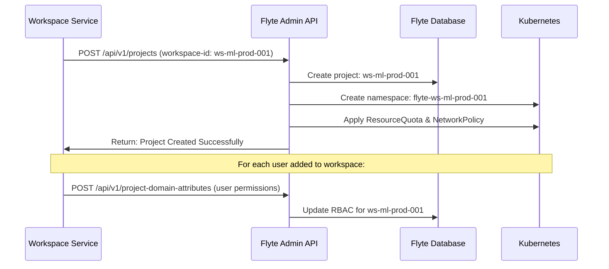

# Dynamic Multi-Workspace Flyte Integration

## 🏢 Workspace-Based Flyte Architecture

### Company Infrastructure Integration

```
┌─────────────────────────────────────────────────────────────────────┐
│                    Company Data Platform                            │
│                                                                     │
│  ┌─────────────────────────────────────────────────────────────┐    │
│  │                Workspace Management Layer                   │    │
│  │  • Workspace Provisioning API                             │    │
│  │  • User Management & RBAC                                 │    │
│  │  • Service Discovery & Registration                       │    │
│  │  • Multi-Service Orchestration                            │    │
│  └─────────────────────────────────────────────────────────────┘    │
│                               │                                     │
│  ┌────────────────────────────┼─────────────────────────────────┐    │
│  │           Services Layer   │                             │    │
│  │                           │                             │    │
│  │  ┌─────────────┬─────────┴──────┬──────────────────┐   │    │
│  │  │ SageMaker   │     Flyte      │   Comprehend     │   │    │
│  │  │ Studio      │   (NEW!)       │   Transcribe     │   │    │
│  │  │             │                │   EMR, Bedrock   │   │    │
│  │  └─────────────┴────────────────┴──────────────────┘   │    │
│  └─────────────────────────────────────────────────────────┘    │
│                               │                                     │
│  ┌────────────────────────────┼─────────────────────────────────┐    │
│  │         Workspace Instances                             │    │
│  │                           │                             │    │
│  │ ┌─────────────────────────┴─────────────────────────┐   │    │
│  │ │  Workspace: ws-ml-prod-001                        │   │    │
│  │ │  • SageMaker Studio ✓                             │   │    │
│  │ │  • Flyte Service ✓ (Auto-created project)         │   │    │
│  │ │  • Bedrock ✓                                      │   │    │
│  │ │  • Users: alice(owner), bob(contrib), charlie...  │   │    │
│  │ │  • Data: s3://ws-ml-prod-001-data/                │   │    │
│  │ └───────────────────────────────────────────────────┘   │    │
│  │                                                         │    │
│  │ ┌───────────────────────────────────────────────────┐   │    │
│  │ │  Workspace: ws-analytics-002                      │   │    │
│  │ │  • EMR ✓                                          │   │    │
│  │ │  • Flyte Service ✓ (Auto-created project)         │   │    │
│  │ │  • Users: diana(owner), eve(contrib), frank...    │   │    │
│  │ │  • Data: s3://ws-analytics-002-data/              │   │    │
│  │ └───────────────────────────────────────────────────┘   │    │
│  │                                                         │    │
│  │            ... (1000s of workspaces)                   │    │
│  └─────────────────────────────────────────────────────────┘    │
└─────────────────────────────────────────────────────────────────────┘
```

## 🎯 Dynamic Workspace-Project Mapping

### Automated Project Creation Flow



## 🔧 Implementation Architecture

### 1. Workspace Integration API

```python
# workspace_flyte_integration.py
from fastapi import FastAPI, HTTPException, Depends
from pydantic import BaseModel
from typing import List, Dict, Optional
import asyncio
from flytekit.clients import FlyteClient
from flytekit.models import Project, Domain

app = FastAPI(title="Workspace-Flyte Integration Service")

class WorkspaceUser(BaseModel):
    user_id: str
    email: str
    role: str  # "owner" or "contributor"
    
class WorkspaceConfig(BaseModel):
    workspace_id: str
    workspace_name: str
    users: List[WorkspaceUser]
    data_bucket: str
    service_config: Dict[str, any]

class FlyteWorkspaceManager:
    def __init__(self):
        self.flyte_client = FlyteClient("flyte-admin.company.com")
    
    async def provision_flyte_service(self, workspace_config: WorkspaceConfig):
        """Automatically provision Flyte project for workspace"""
        
        # 1. Create Flyte project with workspace ID
        project_id = workspace_config.workspace_id
        
        try:
            # Create project
            project = Project(
                id=project_id,
                name=f"Flyte - {workspace_config.workspace_name}",
                description=f"Auto-created Flyte project for workspace {project_id}",
                domains=[
                    Domain(id="development", name="Development"),
                    Domain(id="staging", name="Staging"), 
                    Domain(id="production", name="Production")
                ]
            )
            
            await self.flyte_client.create_project(project)
            
            # 2. Create dedicated namespace
            await self.create_workspace_namespace(project_id)
            
            # 3. Configure user permissions
            await self.configure_workspace_users(project_id, workspace_config.users)
            
            # 4. Set up data access
            await self.configure_data_access(project_id, workspace_config.data_bucket)
            
            return {
                "status": "success",
                "project_id": project_id,
                "flyte_console_url": f"https://flyte-console.company.com/console/projects/{project_id}"
            }
            
        except Exception as e:
            raise HTTPException(status_code=500, detail=f"Failed to provision Flyte: {str(e)}")
    
    async def create_workspace_namespace(self, workspace_id: str):
        """Create dedicated Kubernetes namespace for workspace"""
        
        namespace_config = f"""
apiVersion: v1
kind: Namespace
metadata:
  name: flyte-{workspace_id}
  labels:
    workspace-id: "{workspace_id}"
    flyte.org/tenant: "{workspace_id}"
    managed-by: "workspace-service"
---
apiVersion: v1
kind: ResourceQuota
metadata:
  name: {workspace_id}-quota
  namespace: flyte-{workspace_id}
spec:
  hard:
    requests.cpu: "20"      # 20 CPU cores
    requests.memory: "40Gi" # 40GB RAM
    limits.cpu: "40"        # 40 CPU cores max
    limits.memory: "80Gi"   # 80GB RAM max
    pods: "100"             # Max 100 pods
    persistentvolumeclaims: "20"
---
apiVersion: networking.k8s.io/v1
kind: NetworkPolicy
metadata:
  name: {workspace_id}-isolation
  namespace: flyte-{workspace_id}
spec:
  podSelector: {{}}
  policyTypes:
  - Ingress
  - Egress
  ingress:
  - from:
    - namespaceSelector:
        matchLabels:
          name: flyte-system
  egress:
  - to:
    - namespaceSelector:
        matchLabels:
          name: flyte-system
  - to: []
    ports:
    - protocol: TCP
      port: 443
        """
        
        # Apply via Kubernetes API
        await self.apply_k8s_config(namespace_config)
    
    async def configure_workspace_users(self, workspace_id: str, users: List[WorkspaceUser]):
        """Configure user permissions based on workspace roles"""
        
        for user in users:
            # Determine permissions based on role
            if user.role == "owner":
                permissions = [
                    "workflows:create", "workflows:read", "workflows:update", "workflows:delete",
                    "workflows:execute", "workflows:terminate",
                    "launchplans:create", "launchplans:read", "launchplans:update", "launchplans:delete",
                    "executions:read", "executions:create", "executions:terminate",
                    "data:read", "data:write"
                ]
                domains = ["development", "staging", "production"]
            else:  # contributor
                permissions = [
                    "workflows:create", "workflows:read", "workflows:execute",
                    "launchplans:create", "launchplans:read",
                    "executions:read", "executions:create",
                    "data:read", "data:write"
                ]
                domains = ["development", "staging"]
            
            # Create user role in Flyte
            await self.create_user_role(
                user_id=user.user_id,
                workspace_id=workspace_id,
                permissions=permissions,
                domains=domains
            )
    
    async def configure_data_access(self, workspace_id: str, data_bucket: str):
        """Configure workspace-specific data access"""
        
        # Create service account with workspace-specific IAM role
        service_account_config = f"""
apiVersion: v1
kind: ServiceAccount
metadata:
  name: flyte-{workspace_id}-runner
  namespace: flyte-{workspace_id}
  annotations:
    eks.amazonaws.com/role-arn: arn:aws:iam::ACCOUNT:role/FlyteWorkspace-{workspace_id}-Role
---
apiVersion: iam.aws.amazon.com/v1
kind: Policy
metadata:
  name: FlyteWorkspace-{workspace_id}-DataPolicy
spec:
  policyDocument:
    Version: '2012-10-17'
    Statement:
      - Effect: Allow
        Action:
          - s3:GetObject
          - s3:PutObject
          - s3:DeleteObject
          - s3:ListBucket
        Resource: 
          - "arn:aws:s3:::{data_bucket}/*"
          - "arn:aws:s3:::{data_bucket}"
        """
        
        await self.apply_k8s_config(service_account_config)

# API endpoints
@app.post("/workspace/{workspace_id}/services/flyte")
async def add_flyte_to_workspace(
    workspace_id: str,
    workspace_config: WorkspaceConfig,
    manager: FlyteWorkspaceManager = Depends()
):
    """Add Flyte service to existing workspace"""
    return await manager.provision_flyte_service(workspace_config)

@app.put("/workspace/{workspace_id}/users")
async def update_workspace_users(
    workspace_id: str,
    users: List[WorkspaceUser],
    manager: FlyteWorkspaceManager = Depends()
):
    """Update user permissions when workspace membership changes"""
    await manager.configure_workspace_users(workspace_id, users)
    return {"status": "users updated"}

@app.delete("/workspace/{workspace_id}/services/flyte")
async def remove_flyte_from_workspace(
    workspace_id: str,
    manager: FlyteWorkspaceManager = Depends()
):
    """Remove Flyte service from workspace"""
    await manager.cleanup_workspace_resources(workspace_id)
    return {"status": "flyte service removed"}
```

### 2. Dynamic RBAC Configuration

```python
# dynamic_rbac_manager.py
import asyncio
from typing import Dict, List
from kubernetes import client, config
from flytekit.clients import FlyteClient

class DynamicRBACManager:
    def __init__(self):
        config.load_incluster_config()  # Running inside K8s
        self.k8s_client = client.ApiClient()
        self.flyte_client = FlyteClient()
    
    async def create_workspace_rbac(self, workspace_id: str, users: List[WorkspaceUser]):
        """Create RBAC configuration for workspace dynamically"""
        
        # Generate RBAC manifests
        rbac_config = self.generate_rbac_manifest(workspace_id, users)
        
        # Apply to Kubernetes
        await self.apply_rbac_config(rbac_config)
        
        # Update Flyte authorization
        await self.update_flyte_authorization(workspace_id, users)
    
    def generate_rbac_manifest(self, workspace_id: str, users: List[WorkspaceUser]) -> str:
        """Generate Kubernetes RBAC manifests for workspace"""
        
        # Create role for workspace owners
        owner_role = f"""
apiVersion: rbac.authorization.k8s.io/v1
kind: Role
metadata:
  namespace: flyte-{workspace_id}
  name: {workspace_id}-owner
rules:
- apiGroups: [""]
  resources: ["pods", "configmaps", "secrets"]
  verbs: ["get", "list", "create", "update", "delete"]
- apiGroups: ["batch"]
  resources: ["jobs"]
  verbs: ["get", "list", "create", "update", "delete"]
"""
        
        # Create role for workspace contributors
        contributor_role = f"""
apiVersion: rbac.authorization.k8s.io/v1
kind: Role
metadata:
  namespace: flyte-{workspace_id}
  name: {workspace_id}-contributor
rules:
- apiGroups: [""]
  resources: ["pods", "configmaps"]
  verbs: ["get", "list", "create"]
- apiGroups: ["batch"]
  resources: ["jobs"]
  verbs: ["get", "list", "create"]
"""
        
        # Create role bindings for each user
        bindings = []
        for user in users:
            role_name = f"{workspace_id}-{user.role}"
            binding = f"""
apiVersion: rbac.authorization.k8s.io/v1
kind: RoleBinding
metadata:
  name: {workspace_id}-{user.user_id}-binding
  namespace: flyte-{workspace_id}
subjects:
- kind: User
  name: {user.user_id}
  apiGroup: rbac.authorization.k8s.io
roleRef:
  kind: Role
  name: {role_name}
  apiGroup: rbac.authorization.k8s.io
"""
            bindings.append(binding)
        
        return owner_role + contributor_role + "\n".join(bindings)
    
    async def update_flyte_authorization(self, workspace_id: str, users: List[WorkspaceUser]):
        """Update Flyte authorization database with user permissions"""
        
        # This would integrate with Flyte's authorization system
        # to update user permissions dynamically
        
        for user in users:
            permissions = self.get_permissions_for_role(user.role)
            
            await self.flyte_client.update_user_permissions(
                user_id=user.user_id,
                project_id=workspace_id,
                permissions=permissions
            )
```

### 3. Workspace-Aware Workflow Registration

```python
# workspace_workflow_tools.py
import os
from flytekit import task, workflow, Resources
from typing import Optional

def get_workspace_context() -> Dict[str, str]:
    """Get current workspace context from environment"""
    return {
        "workspace_id": os.environ.get("WORKSPACE_ID"),
        "user_id": os.environ.get("USER_ID"),
        "data_bucket": os.environ.get("WORKSPACE_DATA_BUCKET")
    }

@task(requests=Resources(cpu="200m", mem="500Mi"))
def load_workspace_data(dataset_name: str) -> pd.DataFrame:
    """Load data from workspace-specific bucket"""
    context = get_workspace_context()
    
    # Automatically use workspace data bucket
    data_path = f"s3://{context['data_bucket']}/{dataset_name}"
    
    df = pd.read_csv(data_path)
    return df

@workflow
def workspace_ml_workflow(dataset_name: str, model_type: str) -> str:
    """ML workflow that automatically uses workspace context"""
    
    # All data access is automatically scoped to workspace
    data = load_workspace_data(dataset_name=dataset_name)
    
    # Process within workspace boundaries
    model = train_model(data=data, model_type=model_type)
    
    # Save results to workspace bucket
    result_path = save_model_to_workspace(model=model)
    
    return result_path

# Registration command (automatically uses workspace context)
# pyflyte register --image workspace-registry.com/ml-app:v1.0 workspace_workflow.py
# Project is automatically set to current workspace_id
```

### 4. Scalable Configuration Management

```python
# workspace_config_controller.py
from kubernetes import client, config, watch
import asyncio
import json
from typing import Dict, Any

class WorkspaceConfigController:
    """Kubernetes controller that watches for workspace changes"""
    
    def __init__(self):
        config.load_incluster_config()
        self.v1 = client.CoreV1Api()
        self.custom_api = client.CustomObjectsApi()
    
    async def watch_workspace_changes(self):
        """Watch for workspace configuration changes"""
        
        w = watch.Watch()
        
        # Watch for workspace ConfigMaps
        for event in w.stream(
            self.v1.list_config_map_for_all_namespaces,
            label_selector="app=workspace-config"
        ):
            
            event_type = event['type']
            workspace_config = event['object']
            
            if event_type == "ADDED":
                await self.handle_workspace_created(workspace_config)
            elif event_type == "MODIFIED":
                await self.handle_workspace_updated(workspace_config)
            elif event_type == "DELETED":
                await self.handle_workspace_deleted(workspace_config)
    
    async def handle_workspace_created(self, config_map):
        """Handle new workspace creation"""
        workspace_data = json.loads(config_map.data['workspace.json'])
        
        if 'flyte' in workspace_data.get('services', []):
            # Auto-provision Flyte for this workspace
            manager = FlyteWorkspaceManager()
            await manager.provision_flyte_service(workspace_data)
    
    async def handle_workspace_updated(self, config_map):
        """Handle workspace updates (user changes, etc.)"""
        workspace_data = json.loads(config_map.data['workspace.json'])
        workspace_id = workspace_data['workspace_id']
        
        # Update user permissions
        rbac_manager = DynamicRBACManager()
        await rbac_manager.create_workspace_rbac(
            workspace_id, 
            workspace_data['users']
        )
```

## 🚀 Deployment Strategy

### 1. Integration with Existing Workspace Service

```yaml
# workspace-flyte-integration.yaml
apiVersion: apps/v1
kind: Deployment
metadata:
  name: workspace-flyte-integration
  namespace: platform-services
spec:
  replicas: 3
  selector:
    matchLabels:
      app: workspace-flyte-integration
  template:
    metadata:
      labels:
        app: workspace-flyte-integration
    spec:
      serviceAccount: workspace-flyte-integration-sa
      containers:
      - name: integration-service
        image: company-registry.com/workspace-flyte-integration:v1.0
        env:
        - name: FLYTE_ADMIN_ENDPOINT
          value: "flyte-admin.flyte-system.svc.cluster.local:81"
        - name: WORKSPACE_API_ENDPOINT
          value: "https://workspace-api.company.com"
        ports:
        - containerPort: 8080
        resources:
          requests:
            cpu: 200m
            memory: 512Mi
          limits:
            cpu: 500m
            memory: 1Gi
```

### 2. Workspace Registration Flow

```bash
# Example: Data scientist creates workspace
curl -X POST https://workspace-api.company.com/workspaces \
  -H "Authorization: Bearer $TOKEN" \
  -d '{
    "workspace_name": "Customer Churn Analysis",
    "services": ["sagemaker", "flyte", "bedrock"],
    "users": [
      {"user_id": "alice", "email": "alice@company.com", "role": "owner"},
      {"user_id": "bob", "email": "bob@company.com", "role": "contributor"}
    ]
  }'

# Response includes Flyte project info
{
  "workspace_id": "ws-churn-analysis-001",
  "services": {
    "flyte": {
      "project_id": "ws-churn-analysis-001",
      "console_url": "https://flyte-console.company.com/console/projects/ws-churn-analysis-001",
      "status": "provisioned"
    }
  }
}
```

## 🎯 Benefits of This Architecture

### ✅ **Scalability**
- **No config file management** for thousands of workspaces
- **API-driven** workspace provisioning
- **Kubernetes controllers** handle dynamic changes
- **Event-driven** updates when workspaces change

### ✅ **Integration**
- **Seamless workspace integration** - Flyte becomes just another service
- **Consistent user experience** across all workspace services
- **Unified data access** patterns with existing workspace data buckets
- **Single identity system** across all services

### ✅ **Operations**
- **Auto-provisioning** when Flyte is added to workspace
- **Auto-cleanup** when Flyte is removed from workspace
- **Dynamic user management** as workspace membership changes
- **Centralized monitoring** and audit across all workspaces

### ✅ **Security**
- **Workspace-level isolation** with dedicated namespaces
- **Automatic RBAC** generation based on workspace roles
- **Data boundary enforcement** through IAM and bucket policies
- **Network isolation** between workspaces

This architecture transforms Flyte from a standalone platform into a **workspace-native service** that scales automatically with your company's workspace model! 🚀
